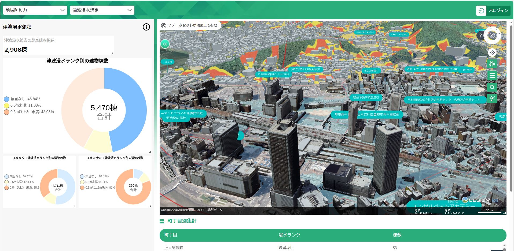

# エリアマネジメント・ダッシュボード
このパッケージでは、イベント情報やバリアフリー情報、災害リスク情報などの地域情報 を3D空間上で確認できる「3D都市モデルビューワ」と、各地域情報の⼀覧や集計結果を表やグラフ形式で確認できる「地域情報ダッシュボード」が同一画面で構成されており、建物や場所に紐づいた地点の情報と、地域単位で集計した情報を相互に連携し閲覧することができます。また、スマートフォンからの情報閲覧、地域情報の登録機能も実装しており、地域情報の集約、公開管理が可能です。
 
 

