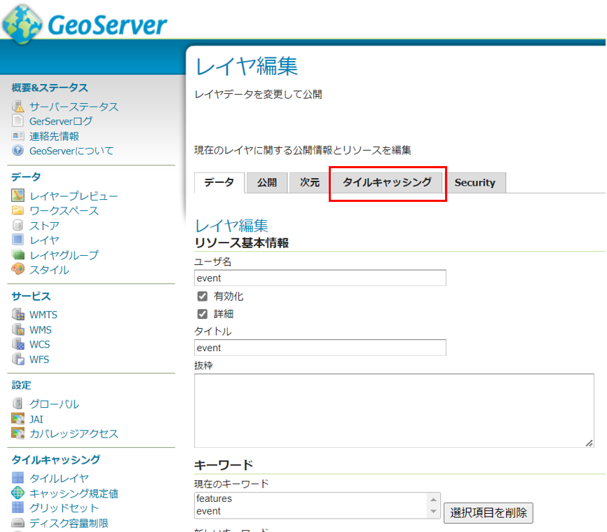
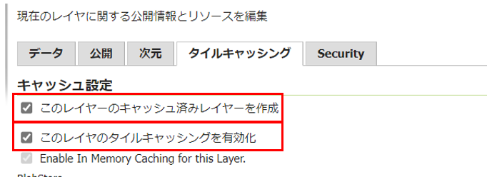
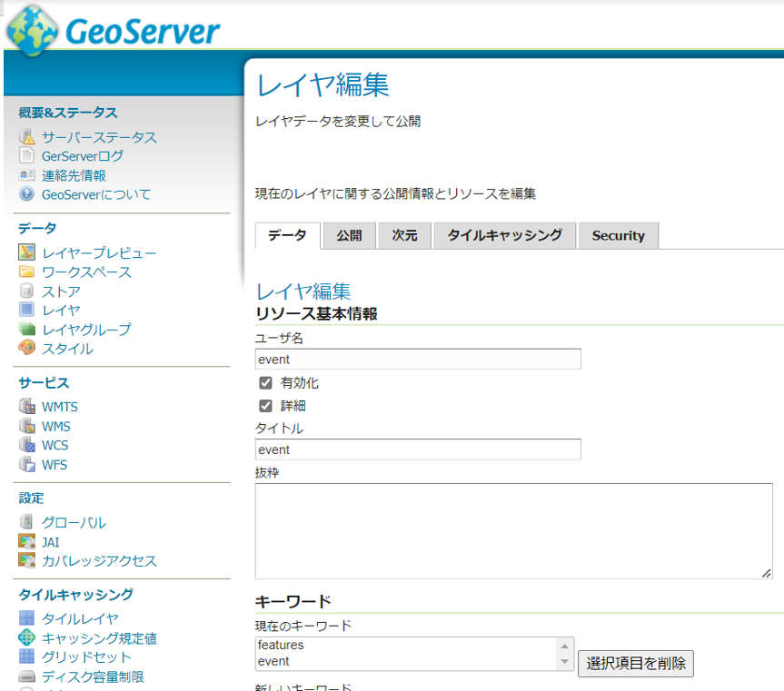

<style>
img {
    border: 1px #dddddd solid;
}
</style>

# 稼動環境構築手順書

# 1 本書について

本書では、エリアマネジメント・ダッシュボード（以下本システム）の稼働環境を構築する手順について記載します。

<br>

# 2 システム構成

本システム稼働環境の構成は以下になります。


Web/APサーバとDBサーバ、データサーバは同一のサーバでも稼働可能ですが、パフォーマンスの観点から別途構築することを推奨します。

以下では、上記稼働環境の前提で稼働環境構築手順を記載します。

<br>

以下、本システムで利用するSW,MWの一覧です。

<table>
<colgroup>
<col style="width: 7%" />
<col style="width: 12%" />
<col style="width: 17%" />
<col style="width: 21%" />
<col style="width: 40%" />
</colgroup>
<thead>
<tr class="header">
<th>#</th>
<th>サーバ</th>
<th>大機能</th>
<th>ライセンス</th>
<th>説明</th>
</tr>
</thead>
<tbody>
<tr class="odd">
<td>1</td>
<td rowspan="11">Web/APサーバ</td>
<td>apache</td>
<td>Apache License 2.0</td>
<td>Webアプリで配信を行うためのWebサーバソフトウェア</td>
</tr>
<tr class="even">
<td>2</td>
<td>ag-grid</td>
<td>ag-Grid Community</td>
<td>グルーピング・集計・フィルタリング等をするためのライブラリ</td>
</tr>
<tr class="even">
<td>3</td>
<td>Chart.js</td>
<td>MIT License</td>
<td>グラフ・チャートを描画するライブラリ</td>
</tr>
<tr class="even">
<td>4</td>
<td>react-grid-layout</td>
<td>MIT License</td>
<td>グリッドレイアウトを実現するためのライブラリ</td>
</tr>
<tr class="even">
<td>5</td>
<td>React</td>
<td>MIT License</td>
<td>JavaScriptのフレームワーク内で機能するUIを構築するためのライブラリ</td>
</tr>
<tr class="odd">
<td>6</td>
<td>Terria</td>
<td>Apache License 2.0</td>
<td><p>UI（ユーザーインターフェイス）の提供及びUIを介してCesium</p>
<p>の描画機能を制御するためのライブラリ</p></td>
</tr>
<tr class="even">
<td>7</td>
<td>Cesium</td>
<td>Apache License 2.0</td>
<td>3Dビューワ上にデータを描画するためのライブラリ</td>
</tr>
<tr class="odd">
<td>8</td>
<td>Node.js</td>
<td>MIT License</td>
<td>3Dビューワの実行環境</td>
</tr>
<tr class="even">
<td>9</td>
<td>GeoServer</td>
<td>GNU GENERAL PUBLIC LICENSE Version 2</td>
<td>各種データをWMS及びWFSなどで配信するためのGISサーバ</td>
</tr>
<tr class="odd">
<td>10</td>
<td>Tomcat</td>
<td>Apache License 2.0</td>
<td>GeoServer、カスタムアプリを起動するJ2EEのSDK</td>
</tr>
<tr class="even">
<td>11</td>
<td>Spring boot</td>
<td>Apache License 2.0</td>
<td>Javaで利用可能なWebアプリのフレームワーク</td>
</tr>
<tr class="odd">
<td>12</td>
<td rowspan="3">DBサーバ</td>
<td>PostgresSQL</td>
<td>PostgreSQL License</td>
<td>各種配信するデータを格納するデータベース</td>
</tr>
<tr class="even">
<td>13</td>
<td>PostGIS</td>
<td>GNU General Public License</td>
<td>PostgreSQLで位置情報を扱うことを可能とするextention</td>
</tr>
<tr class="odd">
<td>14</td>
<td>pgRouting</td>
<td>GNU General Public License version 2</td>
<td>PostgreSQLでルート検索を可能とするextention</td>
</tr>
<tr class="even">
<td>15</td>
<td>データサーバ</td>
<td colspan="2">3DTile等配信データ</td>
<td>データベース以外で配信する3Dデータ等</td>
</tr>
</tbody>
</table>

<br>

稼働環境は以下になります。

【クライアント環境】

ブラウザ要件：Chrome、Safari、Edge（最新のDesktop版）

　　システム要件：CPU: 2 GHz 4コア以上、システムメモリ（RAM）: 4GB

【WEB/APサーバ環境】

- 動作環境：ubuntu

- 必要なソフトウェア：
  
  - Apache Version 2.4
  
  - Java Version 1.8.0_312 (OpenJDK 64-Bit Server VM)
  
  - Apache Tomcat Version 9.0.85
  
  - GeoServer Version 2.20.4
  
  - Node.js Version 16

【DBサーバ環境】

- PostgreSQL Version 14

- PostGIS Version 3

<br>

# 3 準備物一覧

初めに、本システムを構築する際に必要となるresourceはgithub上からダウンロードしてください。

**本リポジトリ（erimane-dashboard-tool）**

手動又はgitコマンドを使用して作業PCにダウンロードしてください。

```Text
git clone 本リポジトリURL erimane-dashboard-tool
```

本書ではerimane-dashboard-tool一式がダウンロードされている前提で説明を行います。

<br>

以下、本システムを構築する際に必要となる準備物一覧になります。

<br>

**【稼働環境】**

Ubuntu

【セットアップ環境】

- 稼働環境と80,8080,5432ポートでTCP通信可能であること

- Windows10

【アプリケーション】

- 3D都市モデルビューワソースコード
  
    対象プロジェクトフォルダ: erimane-dashboard-tool/SRC/3dview/

- API（Springboot）ソースコード
  
    対象プロジェクトフォルダ: erimane-dashboard-tool/SRC/api/

【DDL、設定ファイル等】

- 投入ツール一式
  
    対象フォルダ: erimane-dashboard-tool/SRC/util/

- 設定ファイル一式
  
    対象フォルダ: erimane-dashboard-tool/Settings/area_management_sample_data/
  
    対象フォルダ: erimane-dashboard-tool/Settings/geoserver_settings/
  
    対象フォルダ: erimane-dashboard-tool/Settings/postgres_settings/

【セットアップ用SW】

- GISソフト（本書ではQGISを利用）
  
    https://qgis.org/ja/site/forusers/download.html

- SQLクライアントソフト（本書ではA5:SQL Mk-2を利用）
  
    <https://a5m2.mmatsubara.com/>

※ そのほか構築の際に必須となるSWのインストールは手順の中に含めています。

<br>

# 4 稼働環境構築（事前準備）

構築対象：Web/APサーバ

検証済みサーバ環境：Ubuntu 22.04 LTS

※ セキュリティ関係の設定は必要に応じて自身で設定してください。

※ 基本管理者アカウントで操作を行います。

管理者アカウントに切り替えます。

```Text
sudo -i
```

<br>

## 4-1.npm v6.0 以降、yarn、Node.js v10.0 以降をインストール

<a id="sec41"></a>

npm、yarn、Nodejsのインストールを行います。

```Text
apt update

apt install npm

npm install -g n

npm install -g yarn

n 16

apt purge nodejs npm -y
```

有効になっているnodejsのバージョンを確認します。

```Text
node -v
```

<br>

# 5 稼働環境構築（MW,SW）

<a id="sec5"></a>

検証済みサーバ環境：Ubuntu 22.04.1 LTS

構築対象：Web/APサーバ（DBサーバ）

※ セキュリティ関係の設定は必要に応じて自身で設定してください。

※ 基本管理者アカウントで操作を行います。

管理者アカウントは下記のコマンドで切り替えます。

```Text
sudo -i
```

<br>

## 5-1.Apache2.4のインストール

1. Apache2.4をインストールします。
   
   ```Text
   apt update
   
   apt install apache2
   ```

2. mod_proxyの設定
   
    mod_proxyの設定を行います。
   
   ```Text
   vi /etc/apache2/conf-available/revers_proxy.conf
   ```
   
    下記を追加します。
   
   ```Text
   LimitRequestLine 2097152
   
   # PLATEAU VIEW
   ProxyRequests Off
   ProxyPass /plateau http://localhost:3001
   ProxyPassReverse /plateau http://localhost:3001
   
   # API
   ProxyRequests Off
   ProxyPass /api http://localhost:8080/3dviewapi
   ProxyPassReverse /api http://localhost:8080/3dviewapi
   
   # GeoServer
   <Location /geoserver>
   # For CSRF
   RequestHeader set Origin "http://localhost:8080"
   # For 502
   SetEnv proxy-initial-not-pooled 1
   # SetEnv force-proxy-request-1.0 1
   # SetEnv proxy-nokeepalive 1
   # For proxies
   ProxyPreserveHost On
   ProxyPass http://localhost:8080/geoserver
   ProxyPassReverse http://localhost:8080/geoserver
   </Location>
   ```
   
    必要となるモジュールの有効化を行い再起動します。
   
   ```Text
   a2enconf revers_proxy
   
   a2enmod proxy proxy_http
   
   a2enmod headers
   
   systemctl restart apache2
   ```

※ 起動

「http://<サーバマシンのIPアドレス>/」でアクセスできることを確認してください。

```Text
systemctl start apache2
```

※ 再起動

```Text
systemctl restart apache2
```

※ 停止

```Text
systemctl stop apache2
```

<br>

## 5-2.OpenJDK 8 のインストール

<a id="sec53"></a>

1. openjdk8をインストールします。
   
   ```Text
   add-apt-repository ppa:openjdk-r/ppa
   
   apt update
   
   apt install openjdk-8-jdk
   ```

2. インストール後バージョンを確認します。
   
   ```Text
   java -version
   ```

3. Java Pathの確認を行います。
   
   ```Text
   dirname $(readlink $(readlink $(which java)))
   ```

4. 環境変数を設定します。
   
   ```Text
   vi ~/.bashrc
   ```
   
    最終行に以下の内容を追記し保存します。（/usr/lib/jvm以降は適宜バージョンを確認）
   
   ```Text
   export JAVA_HOME=/usr/lib/jvm/java-8-openjdk-amd64/jre
   export PATH=/usr/lib/jvm/java-8-openjdk-amd64/jre/bin:$PATH
   export CLASSPATH=.:/usr/lib/jvm/java-8-openjdk-amd64/lib
   ```

5. 環境変数の設定を反映します。
   
   ```Text
   source ~/.bashrc
   ```

6. 環境変数の値を出力します。
   
   ```Text
   echo $JAVA_HOME
   ```
   
   <br>

## 5-3.Tomcat 9のインストール

1. ユーザーを作成します。
   
   ```Text
   useradd -m -U -d /opt/tomcat -s /bin/false tomcat
   ```

2. 作業フォルダなどに移動し、tomcatのダウンロードを行います。
   
    適宜tomcatのversionを確認してください。
   
    「/home/work/」などは作業ディレクトリの為適宜置き換えてください。
   
   ```Text
   cd /home/work/
   
   wget http://ftp.yz.yamagata-u.ac.jp/pub/network/apache/tomcat/tomcat-9/v9.0.85/bin/apache-tomcat-9.0.85.tar.gz
   ```

3. 展開及びファイル移動を行います。
   
   ```Text
   tar zxf apache-tomcat-9.0.85.tar.gz
   
   mv apache-tomcat-9.0.85/ /opt/tomcat
   ```

4. 権限の設定を行います。
   
   ```Text
   chown -R tomcat: /opt/tomcat
   
   chmod +x /opt/tomcat/bin/*.sh
   ```

5. サービス定義ファイルを作成します。
   
   ```Text
   vi /etc/systemd/system/tomcat.service
   ```
   
    以下全て入力して保存します。
   
    パス等は適宜環境に合っているか確認してください。
   
   ```Text
   [Unit]
   
   Description=Tomcat 9 servlet container
   
   After=network.target
   
   [Service]
   
   Type=forking
   
   User=tomcat
   
   Group=tomcat
   
   Environment="JAVA_HOME=/usr/lib/jvm/java-8-openjdk-amd64"
   
   Environment="JAVA_OPTS=-Djava.security.egd=file:///dev/urandom -Djava.awt.headless=true"
   
   Environment="CATALINA_BASE=/opt/tomcat"
   
   Environment="CATALINA_HOME=/opt/tomcat"
   
   Environment="CATALINA_PID=/opt/tomcat/temp/tomcat.pid"
   
   Environment="CATALINA_OPTS=-Xms512M -Xmx1024M -server -XX:+UseParallelGC"
   
   ExecStart=/opt/tomcat/bin/startup.sh
   
   ExecStop=/opt/tomcat/bin/shutdown.sh
   
   [Install]
   
   WantedBy=multi-user.target
   ```

6. 設定ファイルの読み込みを行いサービスの起動設定を行います。
   
   ```Text
   systemctl daemon-reload
   
   systemctl enable --now tomcat
   ```

7. タイムゾーンの設定を行います。
   
    環境設定ファイルを新規で作成してください。
   
   ```Text
   vi /opt/tomcat/bin/setenv.sh
   ```
   
    下記を入力後、保存してください。
   
   ```Text
   CATALINA_OPTS="-Duser.timezone=Asia/Tokyo"
   ```
   
    設定を反映させるため、再起動します。
   
   ```Text
   systemctl restart tomcat
   ```

※ 起動

「http://<サーバマシンのIPアドレス>:8080/」でアクセスできることを確認してください。

```Text
systemctl start tomcat
```

※ 再起動

```Text
systemctl restart tomcat
```

※ 停止

```Text
systemctl stop tomcat
```

※ 必要な場合、ファイアーウォールの設定を行います。

```Text
ufw allow 8080/tcp
```

<br>

## 5-4.GeoServer2.20.4のインストール

1. SOURCE FORGEからダウンロード
   
    ブラウザから「 https://geoserver.org/release/2.20.4/ 」にアクセス後、Web Archiveからwarのダウンロード及び解凍を行います。
   
   

2. 解凍したwarをtomcatに配備します。
   
   ```Text
   cd "warが置いてある場所"
   mv geoserver.war /opt/tomcat/webapps/
   ```
   
   <br>

## 5-5.PostgreSQL14とPostGIS3のインストール

※ 本書では、Web/APサーバとDBサーバを同一のサーバ上に構築する手順で記載しております。両サーバを別環境で構築する場合、本章の以下手順はDBサーバ上で実施してください。

1. PostgreSQLのインストールを行います。
   
   ```Text
   sh -c 'echo "deb http://apt.postgresql.org/pub/repos/apt $(lsb_release -cs)-pgdg main" > /etc/apt/sources.list.d/pgdg.list'
   
   apt install curl ca-certificates gnupg
   
   wget --quiet -O - https://www.postgresql.org/media/keys/ACCC4CF8.asc | sudo apt-key add -
   
   apt update
   
   apt install postgresql-14-postgis-3
   ```

※ 起動

```Text
service postgresql start
```

※ 停止

```Text
service postgresql stop
```

※ postgresユーザーへ切り替え

```Text
su - postgres
```

※ 終了

```Text
exit
```

※ PostgreSQL の接続

```Text
psql
```

※ 終了

```Text
exit
```

※ 必要な場合、ファイアーウォールの設定を行います。

```Text
ufw allow 5432/tcp
```

※ 外部からPostgreSQL14への接続を許可する際は下記の設定を変更してください。

postgresql.confの修正

```Text
vi /etc/postgresql/14/main/postgresql.conf
```

listen_addressesとportのコメントアウトを外す。(セキュリティに留意して見直してください。あくまでローカル環境時の確認時の設定方法を記載しています。)

```Text
listen_addresses = '*'

port = 5432
```

pg_hba.confの修正

```Text
vi /etc/postgresql/14/main/pg_hba.conf
```

IPv4の「METHOD」を「password」にし、「ADDRESS」を「all」に変更します。(セキュリティに留意して見直してください。あくまでローカル環境時の確認時の設定方法を記載しています。)

設定の反映の為再起動を行います。

```Text
service postgresql restart
```

<br>

## 5-6.データベースの作成

1. ロールの作成は必要に応じて行ってください。
   
    postgresユーザへ切り替え後、PostgreSQL に接続します。
   
   ```Text
   su - postgres
   
   psql
   ```
   
    ロールを作成します。
   
   <table><tbody><tr>
                <td>CREATE ROLE devps WITH
   
    &nbsp;&nbsp;&nbsp;&nbsp;SUPERUSER
   
    &nbsp;&nbsp;&nbsp;&nbsp;CREATEDB
   
    &nbsp;&nbsp;&nbsp;&nbsp;CREATEROLE
   
    &nbsp;&nbsp;&nbsp;&nbsp;INHERIT
   
    &nbsp;&nbsp;&nbsp;&nbsp;LOGIN
   
    &nbsp;&nbsp;&nbsp;&nbsp;REPLICATION
   
    &nbsp;&nbsp;&nbsp;&nbsp;BYPASSRLS
   
    &nbsp;&nbsp;&nbsp;&nbsp;ENCRYPTED PASSWORD 'password';</td>
   
   </tr></tbody></table>
   
    その他オプション
   
   <table><tbody><tr>
                <td>CREATE ROLE name [ [ WITH ] option [ ... ] ]
   
    option:
   
    &nbsp;&nbsp;&nbsp;&nbsp;SUPERUSER | NOSUPERUSER
   
    &nbsp;&nbsp;&nbsp;&nbsp;| CREATEDB | NOCREATEDB
   
    &nbsp;&nbsp;&nbsp;&nbsp;| CREATEROLE | NOCREATEROLE
   
    &nbsp;&nbsp;&nbsp;&nbsp;| INHERIT | NOINHERIT
   
    &nbsp;&nbsp;&nbsp;&nbsp;| LOGIN | NOLOGIN
   
    &nbsp;&nbsp;&nbsp;&nbsp;| REPLICATION | NOREPLICATION
   
    &nbsp;&nbsp;&nbsp;&nbsp;| BYPASSRLS | NOBYPASSRLS
   
    &nbsp;&nbsp;&nbsp;&nbsp;| CONNECTION LIMIT connlimit
   
    &nbsp;&nbsp;&nbsp;&nbsp;| [ ENCRYPTED ] PASSWORD 'password'
   
    &nbsp;&nbsp;&nbsp;&nbsp;| VALID UNTIL 'timestamp'
   
    &nbsp;&nbsp;&nbsp;&nbsp;| IN ROLE role_name [, ...]
   
    &nbsp;&nbsp;&nbsp;&nbsp;| IN GROUP role_name [, ...]
   
    &nbsp;&nbsp;&nbsp;&nbsp;| ROLE role_name [, ...]
   
    &nbsp;&nbsp;&nbsp;&nbsp;| ADMIN role_name [, ...]
   
    &nbsp;&nbsp;&nbsp;&nbsp;| USER role_name [, ...]
   
    &nbsp;&nbsp;&nbsp;&nbsp;| SYSID uid</td>
   
   </tr></tbody></table>
   
    PostgreSQLを切断
   
   ```Text
   \q
   ```
   
    postgresユーザをログアウト
   
   ```Text
   exit
   ```

2. テーブルスペースとデータベースの作成
   
    PostgreSQL に接続します。
   
   ```Text
   su - postgres
   
   psql
   ```
   
    データベースを作成します。(queryは必要に応じて変更してください)
   
   <table><tbody><tr>
                <td>CREATE DATABASE devps_db
   
    &nbsp;&nbsp;&nbsp;&nbsp;WITH
   
    &nbsp;&nbsp;&nbsp;&nbsp;OWNER = devps;
   
   </td>
    </tr></tbody></table>
    作成したデータベースが一覧に表示されていることを確認してください。
   
   ```Text
   \l
   ```
   
    PostgreSQLを切断
   
   ```Text
   \q
   ```
   
    postgresユーザをログアウト
   
   ```Text
   exit
   ```
   
   <br>

## 5-7.PostGISの有効化

1. postgresユーザへ切り替え後、DB に接続します。
   
   ```Text
   su - postgres
   
   psql -h localhost -p 5432 -U devps -d devps_db
   ```

2. PostGISの有効化を行います。
   
   ```Text
   CREATE EXTENSION postgis;
   ```

3. 正常に有効化されているかバージョン確認を行います。
   
   ```Text
   SELECT PostGIS_version();
   ```
   
    PostgreSQLを切断
   
   ```Text
   \q
   ```
   
    postgresユーザをログアウト
   
   ```Text
   exit
   ```

<br>

## 5-8.pgRoutingの有効化

1. pgRoutingのインストールを行います。
   
   ```Text
   apt install postgresql-14-pgrouting
   ```

2. postgresユーザへ切り替え後、DB に接続します。
   
   ```Text
   su - postgres
   
   psql -h localhost -p 5432 -U devps -d devps_db
   ```

3. pgRoutingの有効化を行います。
   
   ```Text
   CREATE EXTENSION pgrouting;
   ```

4. 正常に有効化されているかバージョン確認を行います。
   
   ```Text
   SELECT * FROM pgr_full_version();
   ```
   
    PostgreSQLを切断
   
   ```Text
   \q
   ```
   
    postgresユーザをログアウト
   
   ```Text
   exit
   ```

<br>

# 6 データ取込（データベース）

<a id="sec6"></a>

**必要リソース①：erimane-dashboard-tool/Settings/postgres_settings/**

**必要リソース②：erimane-dashboard-tool/Settings/area_management_sample_data/**

本システムでは、以下のER図に示すテーブルの登録が必須となります。

#### ①テーマ設定系テーブル


#### ②投稿系テーブル


#### ③地域統計情報・回遊性・歩行者空間データテーブル


#### ④各テーブルの項目定義と取込方式について
各テーブルの項目定義と取込方法について確認し、データの取り込みを行ってください。

<table>
<colgroup>
<col style="width: 15%" />
<col style="width: 30%" />
<col style="width: 14%" />
<col style="width: 13%" />
<col style="width: 25%" />
</colgroup>
<thead>
<tr class="header">
<th>カテゴリ</th>
<th>テーブル名</th>
<th>空間データ</th>
<th>取込方式</th>
<th>説明</th>
</tr>
</thead>
<tbody>
<tr class="odd">
<td rowspan="13">テーマ設定</td>
<td>login_user</td>
<td></td>
<td>DDL</td>
<td>ログインユーザ</td>
</tr>
<tr class="odd">
<td>theme</td>
<td></td>
<td>DDL</td>
<td>テーマ情報</td>
</tr>
<tr class="odd">
<td>layer</td>
<td></td>
<td>DDL</td>
<td>レイヤ情報</td>
</tr>
<tr class="odd">
<td>layer_source</td>
<td></td>
<td>DDL</td>
<td>レイヤ参照元テーブル情報</td>
</tr>
<tr class="odd">
<td>layer_source_field</td>
<td></td>
<td>DDL</td>
<td>レイヤ参照元フィールド情報</td>
</tr>
<tr class="odd">
<td>post_layer_icon_path</td>
<td></td>
<td>DDL</td>
<td>投稿レイヤアイコンパス設定情報</td>
</tr>
<tr class="odd">
<td>graph_list</td>
<td></td>
<td>DDL</td>
<td>グラフ・リスト情報</td>
</tr>
<tr class="odd">
<td>graph_list_type</td>
<td></td>
<td>DDL</td>
<td>グラフ・リストタイプ情報</td>
</tr>
<tr class="odd">
<td>graph_list_template_settings</td>
<td></td>
<td>DDL</td>
<td>グラフ・リストテンプレート設定項目</td>
</tr>
<tr class="odd">
<td>graph_list_template_val</td>
<td></td>
<td>DDL</td>
<td>グラフ・リストテンプレート設定項目値</td>
</tr>
<tr class="odd">
<td>theme_layer</td>
<td></td>
<td>DDL</td>
<td>テーマ_レイヤ関連情報</td>
</tr>
<tr class="odd">
<td>theme_graph_list</td>
<td></td>
<td>DDL</td>
<td>テーマ_グラフ・リスト関連情報</td>
</tr>
<tr class="odd">
<td>layer_graph_cooporation</td>
<td></td>
<td>DDL</td>
<td>レイヤ_グラフ・リスト連携情報</td>
</tr>
<tr class="even">
<td rowspan="4">エリアマネジメント・イベント活動</td>
<td>activity</td>
<td>○</td>
<td>DDL</td>
<td>エリアマネジメント・イベント活動情報</td>
</tr>
<tr class="odd">
<td>activity_type</td>
<td></td>
<td>DDL</td>
<td>エリアマネジメント・イベント活動種別</td>
</tr>
<tr class="even">
<td>attachments</td>
<td></td>
<td>DDL</td>
<td>エリアマネジメント・イベント活動ファイル</td>
</tr>
<tr class="odd">
<td>group_type</td>
<td></td>
<td>DDL</td>
<td>エリアマネジメント・イベント活動グループ種別</td>
</tr>
<tr class="even">
<td rowspan="2">投稿レイヤ</td>
<td>post_layer_feature</td>
<td>○</td>
<td>DDL</td>
<td>投稿レイヤフィーチャ情報</td>
</tr>
<tr class="odd">
<td>post_layer_attribute</td>
<td></td>
<td>DDL</td>
<td>投稿レイヤ属性情報</td>
</tr>
<tr class="even">
<td rowspan="2">歩行空間ネットワークデータ</td>
<td>node_3d</td>
<td>○</td>
<td>GIS</td>
<td>歩行空間ネットワークデータ（ノード）</td>
</tr>
<tr class="odd">
<td>link_3d</td>
<td>○</td>
<td>GIS</td>
<td>歩行空間ネットワークデータ（リンク）</td>
</tr>
<tr class="even">
<td rowspan="9">地域統計情報</td>
<td>chochomokukai_erimane</td>
<td>○</td>
<td>GIS</td>
<td>町丁目界データ</td>
</tr>
<tr class="odd">
<td>chika2</td>
<td></td>
<td>DDL/CSV</td>
<td>地価公示価格</td>
</tr>
<tr class="even">
<td>gis_joint2</td>
<td></td>
<td>DDL/CSV</td>
<td>町丁目別統計情報</td>
</tr>
<tr class="odd">
<td>erimane_ninchido</td>
<td></td>
<td>DDL/CSV</td>
<td>エリアマネジメント団体の認知度</td>
</tr>
<tr class="even">
<td>station_users</td>
<td></td>
<td>DDL/CSV</td>
<td>駅利用者数</td>
</tr>
<tr class="odd">
<td>syokencyosa_shijiritsu</td>
<td></td>
<td>DDL/CSV</td>
<td>商圏調査の支持率</td>
</tr>
<tr class="even">
<td>syogyoshisetsu</td>
<td></td>
<td>DDL/CSV</td>
<td>商業施設</td>
</tr>
<tr class="odd">
<td>region_summary</td>
<td></td>
<td>DDL/CSV</td>
<td>自治体全体の統計値</td>
</tr>
<tr class="even">
<td>sougou_hyouka_result</td>
<td></td>
<td>DDL/CSV</td>
<td>総合評価</td>
</tr>
<tr class="odd">
<td rowspan="7">回遊性</td>
<td>kaiyu_jinryu_nenrei_1</td>
<td></td>
<td>DDL/CSV</td>
<td>回遊分析結果（年齢）</td>
</tr>
<tr class="even">
<td>kaiyu_jinryu_seibetsu_1</td>
<td></td>
<td>DDL/CSV</td>
<td>回遊分析結果（性別）</td>
</tr>
<tr class="odd">
<td>kaiyu_jinryu_ninzuu_1</td>
<td></td>
<td>DDL/CSV</td>
<td>回遊分析結果（人数）</td>
</tr>
<tr class="even">
<td>kaiyu_jinryu_chiiki_1</td>
<td></td>
<td>DDL/CSV</td>
<td>回遊分析結果（地域）</td>
</tr>
<tr class="odd">
<td>kaiyu_jinryu_hosuu_1</td>
<td></td>
<td>DDL/CSV</td>
<td>回遊分析結果（歩数）</td>
</tr>
<tr class="even">
<td>kaiyuusei_{number}</td>
<td>○</td>
<td>GIS</td>
<td><p>回遊性情報（移動データ）</p>
<p>number には分析回数を指定（1,2,3,…）</p></td>
</tr>
<tr class="odd">
<td>accessspot_{number}</td>
<td>○</td>
<td>GIS</td>
<td><p>人気スポット（点データ）</p>
<p>number には分析回数を指定（1,2,3,…）</p></td>
</tr>
</tbody>
</table>

postgres_settingsフォルダ及びarea_management_sample_dataフォルダには表に記載の取込方式「DDL」「CSV」「GIS」の必須データ及びサンプルデータが含まれており、
手順通り進める事でサンプルテーマを作成することができます。

サンプルデータで作成されるテーマを以下に示します。

|テーマ名|説明|
| --- | --- |
|エリアマネジメント活動サンプル|エリアマネジメント活動の登録、管理及び簡易的なダッシュボード画面|
|イベント活動サンプル|イベント活動の登録、管理及び簡易的なダッシュボード画面|
|投稿レイヤサンプル|投稿レイヤの登録、管理及び簡易的なダッシュボード画面|

また共通機能で必要となる地域統計情報、町丁目検索、経路探索のサンプルデータも含まれております。

実際に本システムを活用される際は、ユースケースに合わせて構築及びデータ整備が必要となりますのでご注意ください。

DDL、CSVデータの取込方式については[6-1](#sec63),[6-2](#sec62)を参照してください。

QGISの取込方式については、[6-3](#sec61)を参照してください。

取込順序は [6-1.取込手順（DDL）](#sec63) → [6-2.取込手順（CSV）](#sec62) → [6-3.取込手順（GIS）](#sec61) の順で行います。

地域統計情報・回遊性・歩行者空間データテーブルの項目定義は、[6-4](#sec64)以降の記載を参照してください。

テーマ設定系テーブルの項目定義は、[6-7](#sec67)の記載を参照してください。

投稿系テーブルの項目定義は、[6-8](#sec68)の記載を参照してください。

<br>

## 6-1.取込手順（DDL）

<a id="sec63"></a>

1. psqlで対象DBに接続を行います。
   
   ```Text
   psql -h サーバマシンのIPアドレス -p 5432 -U devps -d devps_db
   ```

2. 一括実行で取込を行います。
   
   ```Text
   \cd /{プロジェクトフォルダへのパス}/erimane-dashboard-tool/Settings/postgres_settings/
   
   \i 1.all_ddl_setup.sql
   
   \i 2.all_view_setup.sql
   
   \i 3.all_dml_setup.sql
   
   \i 4.sample_data_copy.sql
   ```

3. 実行後、以下のテーブルが作成されていることを確認します。
   
   ```Text
   \dt
   ```
   
   
   <br><br>

4. login_userテーブルにログインユーザ情報を投入します。
   
    以下のカラム定義でCSVファイルを作成し、取込を行ってください。
   
    ※ パスワードはSpringBootのソースを使ってハッシュ化する必要があるため、第13章のセットアップ完了後に手順7以降の手順を実施し、取込を行ってください。
   
   <table>
    <colgroup>
    <col style="width: 16%" />
    <col style="width: 16%" />
    <col style="width: 19%" />
    <col style="width: 8%" />
    <col style="width: 10%" />
    <col style="width: 28%" />
    </colgroup>
    <thead>
    <tr class="header">
    <th>カラム名</th>
    <th>カラム論理名</th>
    <th>型</th>
    <th>必須</th>
    <th>主キー</th>
    <th>備考</th>
    </tr>
    </thead>
    <tbody>
    <tr class="odd">
    <td>user_id</td>
    <td>ユーザID</td>
    <td>integer</td>
    <td>○</td>
    <td>○</td>
    <td>一意のID</td>
    </tr>
    <tr class="even">
    <td>login_id</td>
    <td>ログインID</td>
    <td>varchar(50)</td>
    <td></td>
    <td></td>
    <td>ログイン時に使用するID</td>
    </tr>
    <tr class="odd">
    <td>password</td>
    <td>パスワード</td>
    <td>varchar(1024)</td>
    <td></td>
    <td></td>
    <td>ハッシュ化したパスワード</td>
    </tr>
    <tr class="even">
    <td>role</td>
    <td>ロール</td>
    <td>varchar(10)</td>
    <td></td>
    <td></td>
    <td><p>以下のいずれかで設定すること.</p>
    <p>admin : エリアマネジメント団体管理者、システム管理者</p>
    <p>erimane : エリアマネジメント団体ユーザ</p>
    <p>user : 地域住民ユーザ</p></td>
    </tr>
    <tr class="odd">
    <td>user_name</td>
    <td>ユーザ名</td>
    <td>varchar(100)</td>
    <td></td>
    <td></td>
    <td>表示名</td>
    </tr>
    <tr class="even">
    <td>mail_address</td>
    <td>メールアドレス</td>
    <td>varchar(255)</td>
    <td></td>
    <td></td>
    <td>メールアドレス</td>
    </tr>
    </tbody>
    </table>

5. Spring Tool Suite 4を開き、プロジェクトを開きます。
   
   

6. view3d.util.AuthUtil.javaを開きます。
   
   

7. AuthUtil.javaの末尾、public class AuthUtil { }を閉じている中括弧の直前に以下のコードを追記します。
   
   <table><tbody><tr>
                <td>/**
   
   * ハッシュ生成確認用
   
   * 
   
   * @param args 引数(使用しない)
     
     */
     
     public static void main(String[] args) {
     
     System.out.println(AuthUtil.createHash("superStrongP@ssword"));
     
     }</td>
     
     </tr></tbody></table>

8. 「superStrongP@ssword」の部分をパスワードにしたい文字列に置換します。

9. 「3dviewapi」を右クリックし、「実行」>「Spring Bot アプリケーション」を押下します。
   
   

10. 「Javaアプリケーションを選択」で「AuthUtil」を選択し、「OK」を押下します。
    
    

11. 「Javaアプリケーションを選択」で「AuthUtil」を選択し、「OK」を押下します。
    
    「コンソール」に実行結果のハッシュ文字列が出力されるので、コピーして、取込用CSVファイルの「password」列のパスワードを設定したいユーザの行に貼り付けます。
    
    
    
    

12. 10でパスワード文字列を入力した部分を変更して、初回に作成するログインユーザ分のパスワードを作成します。
      ※admin権限のアカウントを作成しておくことで、管理者画面からユーザの追加を行えます。

13. すべてのパスワードを作成し終えたら、9で追記したコードを削除します。

<br>

## 6-2.取込手順（CSV）

<a id="sec62"></a>
※サンプルデータを反映する場合は下記の様な手順で一括取込が行えます。

psqlで対象DBに接続を行います。

```Text
psql -h サーバマシンのIPアドレス -p 5432 -U devps -d devps_db
```

一括実行で取込を行います。

```Text
\cd /{プロジェクトフォルダへのパス}/erimane-dashboard-tool/Settings/area_management_sample_data/

\i sample_data_copy.sql
```

GUIからの取込手順は下記を参照してください。一括実行で取込みを行っている場合は不要です。

1. A5m2を開きます。「データベース」を右クリックし、「データベースの追加と削除」を選択します。
   
   
   
   

2. 「追加」を押下します。
   
   

3. 「PostgreSQL（直接接続）」を選択します。
   
   

4. [第5章](#sec5)で設定したデータベースの接続情報を入力し、「OK」を押下してください。
   
   - サーバー名
   
   - ポート番号
   
   - データベース名
   
   - ユーザーID
   
   - パスワード
     
     

5. 以下の通りツリーが表示されます。作成したDB名をダブルクリックします。
   
   

6. ユーザIDとパスワードを入力し「OK」を押下します。
   
   

7. 以下の通りツリーが展開されます。データベースを右クリックしメニューを開きます。
   
   

8. 「CSV/TSVファイルからテーブル作成（インポート）」を押下します。
   
   

9. インポートするCSVファイルを選択し、「開く」を押下します。
   
   

10. テーブル項目定義に従って、テーブル名と列名、データ型、必須、主キーを設定します。設定後「テーブル作成&インポート」を押下します。
    
    

11. 取込後、テーブルが作成され、テーブルをダブルクリックでデータが表示されるので、内容に相違ないことを確認します。
    
    
    
    

<br>

## 6-3.取込手順（GIS）

<a id="sec61"></a>
**※QGISからlink_3dテーブルの取込後、コスト算出用カラム追加DDLを実行すること**

```Text
/postgres_settings/ddl/add_cost_column.sql
```

**※QGISからchochomokukai_erimaneテーブルの取込後、町丁目検索カラム追加DDLを実行すること**

```Text
/postgres_settings/ddl/add_chochomoku_erimane_column.sql
```

1. 項目定義に合わせたデータ（Shapeファイル）を用意します。フィールド名の文字数制約のため項目定義の内容が反映できない場合、データベースに取込後に変更します。

2. QGISを立ち上げ、「新規プロジェクト」を開きます。
   
   

3. 1で用意したデータをドラッグアンドドロップで開きます。
   
   

4. 以下のように、取り込んだシェープファイルがレイヤに追加され、地図上に表示されます。
   
   
   
    テーブル定義に合わせて属性フィールドを編集します。レイヤを右クリックし、メニューから「属性テーブルを開く」をクリックします。
   
   

5. 以下の通り属性テーブルが表示されますので、ヘッダ左端のボタンで編集モードへの切り替えを行ってください。
   
   

6. フィールドを追加する場合、「フィールドを追加」をクリックし、開いた画面で追加するフィールド名とデータ型を設定します。
   
   
   
   

7. フィールドにデータを一括で格納する場合、フィールド演算機能を利用します。
   
   

8. データベースにデータを取り込みます。
   
    まずはデータベースの接続情報をQGISに登録します。
   
    「ブラウザ」ウィンドウから「PostgreSQL」を右クリックし、「新規接続」を押下します。
   
   

9. データベースへの接続情報を入力します。
- 名前：任意

- ホスト：DBサーバのIPアドレス

- ポート番号：DBのポート番号（デフォルト:5432）

- データベース：データベース名
  
  
10. 「接続テスト」を押下すると、以下のダイアログが開くので、DBに接続するユーザ名とパスワードを入力し、「OK」を押下します。

11. 元の画面に戻り、接続に成功すると「接続に成功しました」のダイアログが表示されるので、「OK」を押下して接続情報を登録します。
    
    

12. ヘッダーメニューから「プラグイン」＞「プラグイン」の管理とインストールを押下します。
    
    

13. 「DB」で検索し、DB Managerが未インストールの場合インストールして有効化します。
    
    

14. 有効化されると、「データベース」> 「DBマネージャ」を開くことができるので開きます。
    
    

15. 以下の通りウィンドウが開くので、「PostGIS」を展開します。
    
    先ほど追加した接続が表示されるので、右クリックします。
    
    
    
    ユーザ名とパスワードを入力し、OKを押下します。
    
    

16. DBマネージャーから「レイヤ/ファイルのインポート」を押下します。
    
    

17. 以下のダイアログが表示されます。
    
    「入力」で入力するレイヤを指定します。
    
    テーブルに、取り込み先となるテーブル名を入力します。
    
    主キー、ジオメトリのカラムに指定がなければ、チェックを入れデフォルト（id, geom）のままとしておきます。
    
    上書き更新する場合、「出力先テーブルを置き換える」にチェックを入れます。
    
    「空間インデックスを作成」にチェックを入れます。
    
    
    
    「OK」を押下すると、インポートが開始します。
    
    インポートが完了すると、「インポートは成功しました」のダイアログが表示されます。
    
    

<br>

## 6-4.テーブル項目定義（歩行空間ネットワークデータ）

<a id="sec64"></a>

1. 歩行空間ネットワークデータ（ノード）

■ テーブル定義

| テーブル名 | node_3d |
| ----- | ------- |

■ カラム定義

※ 経路探索機能で使用する最低限のカラムのみ記載。用途に応じてカラムは追加可能。

<table>
<colgroup>
<col style="width: 16%" />
<col style="width: 16%" />
<col style="width: 17%" />
<col style="width: 8%" />
<col style="width: 10%" />
<col style="width: 29%" />
</colgroup>
<thead>
<tr class="header">
<th>カラム名</th>
<th>カラム論理名</th>
<th>型</th>
<th>必須</th>
<th>主キー</th>
<th>備考</th>
</tr>
</thead>
<tbody>
<tr class="odd">
<td>id</td>
<td>ID</td>
<td>integer</td>
<td>○</td>
<td>○</td>
<td><p>一意のID</p>
<p>QGISから取り込んだ際に採番するため、元データには設定不要</p></td>
</tr>
<tr class="even">
<td>geom</td>
<td>ジオメトリ</td>
<td>geometry</td>
<td></td>
<td></td>
<td><p>ポイント（3D）</p>
<p>座標系は平面直角座標系とすること</p></td>
</tr>
<tr class="odd">
<td>node_id</td>
<td>ノードID</td>
<td>varchar(40)</td>
<td></td>
<td></td>
<td><p>ノードを識別する一意のID.リンクの開始・終了ノードIDとの対応が必要.</p>
<p>Integer型に型変換可能な値とすること</p></td>
</tr>
</tbody>
</table>

2. 歩行空間ネットワークデータ（リンク）

■ テーブル定義

| テーブル名 | link_3d |
| ----- | ------- |

■ カラム定義

※ 経路探索機能で使用する最低限のカラムのみ記載。用途に応じてカラムは追加可能。

<table style="width:100%;">
<colgroup>
<col style="width: 22%" />
<col style="width: 15%" />
<col style="width: 17%" />
<col style="width: 8%" />
<col style="width: 9%" />
<col style="width: 27%" />
</colgroup>
<thead>
<tr class="header">
<th>カラム名</th>
<th>カラム論理名</th>
<th>型</th>
<th>必須</th>
<th>主キー</th>
<th>備考</th>
</tr>
</thead>
<tbody>
<tr class="odd">
<td>id</td>
<td>ID</td>
<td>integer</td>
<td>○</td>
<td>○</td>
<td><p>一意のID</p>
<p>QGISから取り込んだ際に採番するため、元データには設定不要</p></td>
</tr>
<tr class="even">
<td>geom</td>
<td>ジオメトリ</td>
<td>geometry</td>
<td></td>
<td></td>
<td><p>ポリライン（3D）</p>
<p>座標系は平面直角座標系とすること</p></td>
</tr>
<tr class="odd">
<td>link_id</td>
<td>リンクID</td>
<td>varchar(40)</td>
<td></td>
<td></td>
<td><p>リンクを識別する一意のID.</p>
<p>Integer型に型変換可能な値とすること</p></td>
</tr>
<tr class="even">
<td>start_id</td>
<td>開始ID</td>
<td>varchar(40)</td>
<td></td>
<td></td>
<td><p>リンクの開始点のノードID.</p>
<p>Integer型に型変換可能な値とすること</p></td>
</tr>
<tr class="odd">
<td>end_id</td>
<td>終了ID</td>
<td>varchar(40)</td>
<td></td>
<td></td>
<td><p>リンクの終了点のノードID.</p>
<p>Integer型に型変換可能な値とすること</p></td>
</tr>
<tr class="even">
<td>distance</td>
<td>距離</td>
<td>double precision</td>
<td></td>
<td></td>
<td><p>リンクの距離.</p>
<p>経路探索（健常者向け）で使用.</p></td>
</tr>
<tr class="odd">
<td>rt_struct</td>
<td>経路の構造</td>
<td>bigint</td>
<td></td>
<td></td>
<td><p>1: 車道と歩道の物理的な分離あり</p>
<p>2: 車道と歩道の物理的な分離なし</p>
<p>3: 横断歩道</p>
<p>4: 横断歩道の路面標示の無い道路の横断部</p>
<p>5: 地下通路</p>
<p>6: 歩道橋　（ペデストリアンデッキ含む）</p>
<p>7: 施設内通路</p>
<p>8: その他の経路の構造</p>
<p>99: 不明</p></td>
</tr>
<tr class="even">
<td>route_type</td>
<td>経路の種別</td>
<td>bigint</td>
<td></td>
<td></td>
<td><p>1: 対応する属性情報なし</p>
<p>2: 動く歩道</p>
<p>3: 踏切</p>
<p>4: エレベーター</p>
<p>5: エスカレーター</p>
<p>6: 階段</p>
<p>7: スロープ</p>
<p>99: 不明</p></td>
</tr>
<tr class="odd">
<td>direction</td>
<td>方向性</td>
<td>bigint</td>
<td></td>
<td></td>
<td><p>1: 両方向</p>
<p>2: 起点より終点方向</p>
<p>3: 終点より起点方向</p>
<p>99: 不明</p></td>
</tr>
<tr class="even">
<td>width</td>
<td>幅員</td>
<td>bigint</td>
<td></td>
<td></td>
<td><p>1: 1.0m 未満</p>
<p>2: 1.0m 以上～2.0m 未満</p>
<p>3: 2.0m以上～3.0m 未満</p>
<p>4: 3.0m 以上</p>
<p>99: 不明</p></td>
</tr>
<tr class="odd">
<td>vtcl_slope</td>
<td>縦断勾配</td>
<td>bigint</td>
<td></td>
<td></td>
<td><p>1: 5％以下</p>
<p>2: 5％より大きい（起点より終点が高い）</p>
<p>3: 5％より大きい（起点より終点が低い）</p>
<p>99: 不明</p></td>
</tr>
<tr class="even">
<td>lev_diff</td>
<td>段差</td>
<td>bigint</td>
<td></td>
<td></td>
<td><p>1: 2 ㎝以下</p>
<p>2: 2 ㎝より大きい</p>
<p>99: 不明</p></td>
</tr>
<tr class="odd">
<td>tfc_signal</td>
<td>歩行者用信号機の有無</td>
<td>bigint</td>
<td></td>
<td></td>
<td><p>1: 歩行者用信号機なし</p>
<p>2: 歩車分離式信号機あり</p>
<p>3: 押しボタン式信号機あり</p>
<p>4: これら以外の信号機</p>
<p>99: 不明</p></td>
</tr>
<tr class="even">
<td>tfc_s_type</td>
<td>歩行者用信号機の種別</td>
<td>bigint</td>
<td></td>
<td></td>
<td><p>1: 音響設備なし</p>
<p>2: 音響設備あり（音響用押しボタンなし）</p>
<p>3: 音響設備あり（音響用押しボタンあり）</p>
<p>4: これら以外の信号機</p>
<p>99: 不明</p></td>
</tr>
<tr class="odd">
<td>brail_tile</td>
<td>視覚障害者誘導用ブロック等の有無</td>
<td>bigint</td>
<td></td>
<td></td>
<td><p>1: 視覚障害者誘導用ブロック等なし</p>
<p>2: 視覚障害者誘導用ブロック等あり</p>
<p>99: 不明</p></td>
</tr>
<tr class="even">
<td>elevator</td>
<td>エレベーターの種別</td>
<td>bigint</td>
<td></td>
<td></td>
<td><p>1: エレベーターなし</p>
<p>2: エレベーターあり（バリアフリー対応なし）</p>
<p>3: エレベーターあり（車いす使用者対応）</p>
<p>4: エレベーターあり（視覚障害者対応）</p>
<p>5: エレベーターあり（車いす使用者、視覚障害者対応）</p>
<p>99: 不明</p></td>
</tr>
<tr class="odd">
<td>roof</td>
<td>屋根の有無</td>
<td>bigint</td>
<td></td>
<td></td>
<td><p>1: なし</p>
<p>2: あり</p>
<p>99: 不明</p></td>
</tr>
<tr class="even">
<td>cost_wheelchair</td>
<td>車いす利用者向けコスト</td>
<td>double precision</td>
<td></td>
<td></td>
<td><p>車いす利用者向け経路探索用コスト.</p>
<!-- <p>値はデータベース取込後、「[第10章](#sec10)」の手順でセットすること.</p></td> -->
<p>値はデータベース取込後、<a href="#sec10">第10章</a>の手順でセットすること.</p></td>
</tr>
<tr class="odd">
<td>cost_elderly</td>
<td>高齢者向けコスト</td>
<td>double precision</td>
<td></td>
<td></td>
<td><p>高齢者・乳幼児向け経路探索用コスト.</p>
<!-- <p>値はデータベース取込後、「[第10章](#sec10)」の手順でセットすること.</p></td> -->
<p>値はデータベース取込後、<a href="#sec10">第10章</a>の手順でセットすること.</p></td>
</tr>
<tr class="even">
<td>cost_brail</td>
<td>視覚障害者向けコスト</td>
<td>double precision</td>
<td></td>
<td></td>
<td><p>視覚障害者向け経路探索用コスト.</p>
<!-- <p>値はデータベース取込後、「[第10章](#sec10)」の手順でセットすること.</p></td> -->
<p>値はデータベース取込後、<a href="#sec10">第10章</a>の手順でセットすること.</p></td>
</tr>
</tbody>
</table>

<br>

## 6-5.テーブル項目定義（地域統計情報）

1. 町丁目界データ

■ テーブル定義

| テーブル名 | chochomokukai_erimane |
| ----- | --------------------- |

■ カラム定義

※ 用途に応じてカラムは追加可能。

<table>
<colgroup>
<col style="width: 28%" />
<col style="width: 12%" />
<col style="width: 18%" />
<col style="width: 7%" />
<col style="width: 8%" />
<col style="width: 24%" />
</colgroup>
<thead>
<tr class="header">
<th>カラム名</th>
<th>カラム論理名</th>
<th>型</th>
<th>必須</th>
<th>主キー</th>
<th>備考</th>
</tr>
</thead>
<tbody>
<tr class="odd">
<td>id</td>
<td>ID</td>
<td>integer</td>
<td>○</td>
<td>○</td>
<td><p>一意のID</p>
<p>QGISから取り込んだ際に採番するため、元データには設定不要</p></td>
</tr>
<tr class="even">
<td>geom</td>
<td>ジオメトリ</td>
<td>geometry</td>
<td></td>
<td></td>
<td>マルチポリゴン型</td>
</tr>
<tr class="odd">
<td>s_name</td>
<td>町丁目名</td>
<td>varchar(100)</td>
<td></td>
<td></td>
<td><p>一意の町丁目名.</p>
<p>ダッシュボード表示時にgis_joint2テーブルと結合利用.</p></td>
</tr>
<tr class="even">
<td>area_management_type</td>
<td>エリアマネジメント団体種別名</td>
<td>varchar(100)</td>
<td></td>
<td></td>
<td></td>
</tr>
<tr class="odd">
<td>3dview_url</td>
<td>3D都市モデルビューワ連携URL</td>
<td>text</td>
<td></td>
<td></td>
<td>使用しない</td>
</tr>
<tr class="even">
<td>town_name</td>
<td>町名</td>
<td>text</td>
<td></td>
<td></td>
<td>検索用の町名を追加すること</td>
</tr>
<tr class="odd">
<td>block_name</td>
<td>丁名</td>
<td>text</td>
<td></td>
<td></td>
<td>検索用の丁名を追加すること</td>
</tr>
</tbody>
</table>

2. 地価公示価格

■ テーブル定義

| テーブル名 | chika2 |
| ----- | ------ |

■ カラム定義

※ カラム内容は固定。

| カラム名 | カラム論理名 | 型           | 必須  | 主キー | 備考                   |
| ---- | ------ | ----------- | --- | --- | -------------------- |
| id   | ID     | integer     | ○   | ○   | 一意のID                |
| 地点名  | 地点名    | varchar(50) |     |     |                      |
| 和暦   | 和暦     | varchar(20) |     |     |                      |
| 西暦   | 西暦     | integer     |     |     |                      |
| 地価   | 地価     | integer     |     |     |                      |
| 区分   | 区分     | varchar(20) |     |     |                      |
| エリア  | エリア    | varchar(20) |     |     | group_typeテーブルの区分と対応 |

　　■ データサンプル

| id  | 地点名    | 和暦    | 西暦   | 地価      | 区分  | エリア |
| --- | ------ | ----- | ---- | ------- | --- | --- |
| 1   | ○○東5-1 | 平成30年 | 2018 | 473000  | 商業地 | キタ  |
| 2   | ○○東5-1 | 令和元年  | 2019 | 506000  | 商業地 | キタ  |
| 3   | ○○南5-9 | 平成30年 | 2018 | 2080000 | 商業地 | ミナミ |
| 4   | ○○南5-9 | 令和元年  | 2019 | 2160000 | 商業地 | ミナミ |

3. 町丁目別統計項目

■ テーブル定義

| テーブル名 | gis_joint2 |
| ----- | ---------- |

■ カラム定義

※ カラム内容は固定。

<table>
<colgroup>
<col style="width: 16%" />
<col style="width: 16%" />
<col style="width: 17%" />
<col style="width: 8%" />
<col style="width: 10%" />
<col style="width: 30%" />
</colgroup>
<thead>
<tr class="header">
<th>カラム名</th>
<th>カラム論理名</th>
<th>型</th>
<th>必須</th>
<th>主キー</th>
<th>備考</th>
</tr>
</thead>
<tbody>
<tr class="odd">
<td>id</td>
<td>ID</td>
<td>integer</td>
<td>○</td>
<td>○</td>
<td>一意のID</td>
</tr>
<tr class="even">
<td>地点名</td>
<td>地点名</td>
<td>varchar(50)</td>
<td></td>
<td></td>
<td><p>町丁目名.</p>
<p>chochomokukai_erimaneのs_nameと対応.</p></td>
</tr>
<tr class="odd">
<td>エリアマネジメント</td>
<td>エリアマネジメント</td>
<td>varchar(50)</td>
<td></td>
<td></td>
<td>group_typeテーブルの区分と対応</td>
</tr>
<tr class="even">
<td>カテゴリ</td>
<td>カテゴリ</td>
<td>varchar(50)</td>
<td></td>
<td></td>
<td>統計項目</td>
</tr>
<tr class="odd">
<td>和暦</td>
<td>和暦</td>
<td>varchar(10)</td>
<td></td>
<td></td>
<td>統計年度（和暦）</td>
</tr>
<tr class="even">
<td>西暦</td>
<td>西暦</td>
<td>integer</td>
<td></td>
<td></td>
<td>統計年度（西暦）</td>
</tr>
<tr class="odd">
<td>数</td>
<td>数</td>
<td>integer</td>
<td></td>
<td></td>
<td>統計値</td>
</tr>
</tbody>
</table>

■ データサンプル

| id  | 地点名 | エリアマネジメント | カテゴリ | 和暦  | 西暦   | 数    |
| --- | --- | ---- | ---- | --- | ---- | ---- |
| 1   | 東町  | ヒガシ  | 人口   | R4  | 2022 | 1780 |
| 2   | 東町  | ヒガシ  | 人口   | R3  | 2021 | 1801 |
| 3   | 東町  | ヒガシ  | 世帯   | R4  | 2022 | 904  |
| 4   | 東町  | ヒガシ  | 世帯   | R3  | 2021 | 900  |
| 5   | 東町  | ヒガシ  | 事業所  | H28 | 2016 | 99   |
| 6   | 東町  | ヒガシ  | 事業所  | H26 | 2014 | 99   |
| 7   | 東町  | ヒガシ  | 単身世帯 | R4  | 2022 | 421  |
| 8   | 西町  | ニシ   | 人口   | R4  | 2022 | 1860 |
| 9   | 西町  | ニシ   | 人口   | R3  | 2021 | 1879 |
| 10  | 西町  | ニシ   | 世帯   | R4  | 2022 | 1271 |
| 11  | 西町  | ニシ   | 世帯   | R3  | 2021 | 1280 |
| 12  | 西町  | ニシ   | 事業所  | H28 | 2016 | 218  |
| 13  | 西町  | ニシ   | 事業所  | H26 | 2014 | 223  |
| 14  | 西町  | ニシ   | 単身世帯 | R4  | 2022 | 865  |

4. エリアマネジメント団体の認知度

■ テーブル定義

| テーブル名 | erimane_ninchido |
| ----- | ---------------- |

■ カラム定義

※ カラム内容は固定。

| カラム名 | カラム論理名 | 型           | 必須  | 主キー | 備考    |
| ---- | ------ | ----------- | --- | --- | ----- |
| id   | ID     | integer     | ○   | ○   | 一意のID |
| エリア  | エリア    | varchar(50) |     |     |       |
| 和暦   | 和暦     | varchar(10) |     |     |       |
| 西暦   | 西暦     | integer     |     |     |       |
| 認知度  | 認知度    | numeric     |     |     |       |

■ データサンプル

| id  | エリア | 和暦  | 西暦   | 認知度  |
| --- | --- | --- | ---- | ---- |
| 1   | キタ  | R4  | 2022 | 0.3  |
| 2   | キタ  | R5  | 2023 | 0.35 |
| 3   | ミナミ | R4  | 2022 | 0.3  |
| 4   | ミナミ | R5  | 2023 | 0.35 |
| 5   | ナカ  | R4  | 2022 | 0.3  |
| 6   | ナカ  | R5  | 2023 | 0.35 |

5. 駅利用者数

■ テーブル定義

| テーブル名 | station_users |
| ----- | ------------- |

■ カラム定義

※ カラム内容は固定。

| カラム名 | カラム論理名 | 型           | 必須  | 主キー | 備考    |
| ---- | ------ | ----------- | --- | --- | ----- |
| id   | ID     | integer     | ○   | ○   | 一意のID |
| 会社名  | 会社名    | varchar(50) |     |     |       |
| 年    | 年      | varchar(5)  |     |     |       |
| 利用者数 | 利用者数   | integer     |     |     |       |

■ データサンプル

| id  | 会社名  | 年    | 利用者数   |
| --- | ---- | ---- | ------ |
| 1   | ○○電鉄 | 2017 | 29097  |
| 2   | ○○電鉄 | 2018 | 30122  |
| 3   | ○○電鉄 | 2019 | 32791  |
| 4   | ○○電鉄 | 2020 | 16550  |
| 5   | ××鉄道 | 2017 | 154338 |
| 6   | ××鉄道 | 2018 | 154238 |
| 7   | ××鉄道 | 2019 | 154184 |
| 8   | ××鉄道 | 2020 | 101090 |

6. 商圏調査の支持率

■ テーブル定義

| テーブル名 | syokencyosa_shijiritsu |
| ----- | ---------------------- |

■ カラム定義

※ カラム内容は固定。

| カラム名  | カラム論理名 | 型                | 必須  | 主キー | 備考    |
| ----- | ------ | ---------------- | --- | --- | ----- |
| id    | ID     | integer          | ○   | ○   | 一意のID |
| 商圏エリア | 商圏エリア  | varchar(50)      |     |     |       |
| 割合    | 割合     | Double precision |     |     | %     |

■ データサンプル

| id  | 商圏エリア   | 割合   |
| --- | ------- | ---- |
| 1   | ●●町     | 44.4 |
| 2   | ■■町     | 32.2 |
| 3   | ×山      | 15.1 |
| 4   | ○○市役所周辺 | 4.1  |
| 5   | ○○駅前    | 4.2  |

<br>

7. 商業施設

■ テーブル定義

| テーブル名 | syogyoshisetsu |
| ----- | -------------- |

■ カラム定義

※ カラム内容は固定。

| カラム名 | カラム論理名 | 型            | 必須  | 主キー | 備考    |
| ---- | ------ | ------------ | --- | --- | ----- |
| id   | ID     | integer      | ○   | ○   | 一意のID |
| 店舗名  | 店舗名    | varchar(100) |     |     |       |
| 住所   | 住所     | varchar(100) |     |     |       |
| 開設年  | 開設年    | integer      |     |     |       |
| 店舗面積 | 店舗面積   | integer      |     |     |       |

■ データサンプル

| id  | 店舗名   | 住所         | 開設年  | 店舗面積  |
| --- | ----- | ---------- | ---- | ----- |
| 1   | ○○百貨店 | xx区○○町12-1 | 1999 | 40825 |
| 2   | ●●マート | xx区■■町1-4  | 2013 | 10357 |
| 3   | ××シティ | ○○区△△町4-2  | 2016 | 7788  |

8. 自治体全体の統計値

■ テーブル定義

| テーブル名 | region_summary |
| ----- | -------------- |

■ カラム定義

※ カラム内容は固定。

<table>
<colgroup>
<col style="width: 16%" />
<col style="width: 16%" />
<col style="width: 17%" />
<col style="width: 8%" />
<col style="width: 10%" />
<col style="width: 29%" />
</colgroup>
<thead>
<tr class="header">
<th>カラム名</th>
<th>カラム論理名</th>
<th>型</th>
<th>必須</th>
<th>主キー</th>
<th>備考</th>
</tr>
</thead>
<tbody>
<tr class="odd">
<td>id</td>
<td>ID</td>
<td>integer</td>
<td>○</td>
<td>○</td>
<td>一意のID</td>
</tr>
<tr class="even">
<td>カテゴリ</td>
<td>カテゴリ</td>
<td>text</td>
<td></td>
<td></td>
<td><p>以下のいずれかで設定すること.</p>
<p>・人口</p>
<p>・世帯数</p>
<p>・駅利用者数まとめ</p>
<p>・事業所数</p>
<p>・従業者数</p>
<p>・公示地価</p>
<p>総合評価の算出処理で使用するので、すべてのカテゴリを設定すること.</p></td>
</tr>
<tr class="odd">
<td>和暦</td>
<td>和暦</td>
<td></td>
<td></td>
<td></td>
<td></td>
</tr>
<tr class="even">
<td>西暦</td>
<td>西暦</td>
<td>integer</td>
<td></td>
<td></td>
<td></td>
</tr>
<tr class="odd">
<td>値</td>
<td>値</td>
<td>double precision</td>
<td></td>
<td></td>
<td>統計値</td>
</tr>
</tbody>
</table>

　　■ データサンプル

| id  | カテゴリ     | 和暦  | 西暦   | 値        |
| --- | -------- | --- | ---- | -------- |
| 1   | 人口       | R3  | 2021 | 1189149  |
| 2   | 人口       | R4  | 2022 | 1187049  |
| 3   | 世帯数      | R3  | 2021 | 575232   |
| 4   | 世帯数      | R4  | 2022 | 578741   |
| 5   | 駅利用者数まとめ | R1  | 2019 | 363226   |
| 6   | 駅利用者数まとめ | R2  | 2020 | 269578   |
| 7   | 事業所数     | H26 | 2014 | 55733    |
| 8   | 事業所数     | H28 | 2016 | 53327    |
| 9   | 従業者数     | H26 | 2014 | 599407   |
| 10  | 従業者数     | H28 | 2016 | 581331   |
| 11  | 公示地価     | R3  | 2021 | 525312.5 |
| 12  | 公示地価     | R4  | 2022 | 541750   |

<br>

9. 総合評価

■ テーブル定義

| テーブル名 | sougou_hyouka_result |
| ----- | -------------------- |

■ カラム定義

※ カラム内容は固定。

<table>
<colgroup>
<col style="width: 16%" />
<col style="width: 16%" />
<col style="width: 17%" />
<col style="width: 8%" />
<col style="width: 10%" />
<col style="width: 29%" />
</colgroup>
<thead>
<tr class="header">
<th>カラム名</th>
<th>カラム論理名</th>
<th>型</th>
<th>必須</th>
<th>主キー</th>
<th>備考</th>
</tr>
</thead>
<tbody>
<tr class="odd">
<td>id</td>
<td>ID</td>
<td>integer</td>
<td>○</td>
<td>○</td>
<td><p>一意のID</p>
<p>QGISから取り込んだ際に採番するため、元データには設定不要</p></td>
</tr>
<tr class="even">
<td>カテゴリ</td>
<td>カテゴリ</td>
<td>text</td>
<td></td>
<td></td>
<td><p>以下のいずれかで設定すること.</p>
<p>・人口</p>
<p>・世帯数</p>
<p>・駅利用者数まとめ</p>
<p>・事業所数</p>
<p>・従業者数</p>
<p>・公示地価</p>
<p>・総合評価</p>
<p>すべてのカテゴリを設定すること.</p></td>
</tr>
<tr class="odd">
<td>年度</td>
<td>年度</td>
<td>integer</td>
<td></td>
<td></td>
<td></td>
</tr>
<tr class="even">
<td>全体比較</td>
<td>全体比較</td>
<td>double precision</td>
<td></td>
<td></td>
<td></td>
</tr>
<tr class="odd">
<td>過去比較</td>
<td>過去比較</td>
<td>double precision</td>
<td></td>
<td></td>
<td></td>
</tr>
</tbody>
</table>

■ データサンプル

| id  | カテゴリ     | 年度   | 全体比較     | 過去比較     |
| --- | -------- | ---- | -------- | -------- |
| 1   | 人口       | 2022 | 3.022594 | 2.999128 |
| 2   | 世帯数      | 2022 | 2.997356 | 3.016077 |
| 3   | 駅利用者数まとめ | 2022 | 2.59621  | 1.895085 |
| 4   | 事業所数     | 2022 | 3.116334 | 3.000    |
| 5   | 従業者数     | 2022 | 3.303411 | 3.000    |
| 6   | 公示地価     | 2022 | 3.091724 | 3.122362 |
| 7   | 総合評価     | 2022 | 3.021272 | 2.838775 |

<br>

## 6-6.テーブル項目定義（回遊性）

1. 回遊分析結果（年齢）

■ テーブル定義

| テーブル名 | kaiyu_jinryu_nenrei_1 |
| ----- | --------------------- |

■ カラム定義

※ カラム内容は固定。

| カラム名 | カラム論理名 | 型               | 必須  | 主キー | 備考                   |
| ---- | ------ | --------------- | --- | --- | -------------------- |
| id   | ID     | integer         | ○   | ○   | 一意のID                |
| 項目   | 項目     | varchar(50)     |     |     |                      |
| 人数   | 人数     | double preciion |     |     |                      |
| 割合   | 割合     | double preciion |     |     | 同じ回数で合計1.0となるように設定   |
| 回数   | 回数     | integer         |     |     | 分析回数を設定すること. 1,2,3,… |
| 項目id | 項目id   | integer         |     |     | 項目に対応する一意のID         |

■ データサンプル

| id  | 項目    | 人数  | 割合       | 回数  | 項目id |
| --- | ----- | --- | -------- | --- | ---- |
| 1   | 20歳未満 | 16  | 0.06015  | 1   | 1    |
| 2   | 20代   | 33  | 0.12406  | 1   | 2    |
| 6   | 20歳未満 | 10  | 0.045662 | 2   | 1    |
| 7   | 20代   | 30  | 0.136986 | 2   | 2    |

<br>

2. 回遊分析結果（性別）

■ テーブル定義

| テーブル名 | kaiyu_jinryu_seibetsu_1 |
| ----- | ----------------------- |

■ カラム定義

※ カラム内容は固定。

| カラム名 | カラム論理名 | 型               | 必須  | 主キー | 備考                   |
| ---- | ------ | --------------- | --- | --- | -------------------- |
| id   | ID     | integer         | ○   | ○   | 一意のID                |
| 性別   | 性別     | varchar(20)     |     |     |                      |
| 人数   | 人数     | double preciion |     |     |                      |
| 割合   | 割合     | double preciion |     |     | 同じ回数で合計1.0となるように設定   |
| 回数   | 回数     | integer         |     |     | 分析回数を設定すること. 1,2,3,… |

■ データサンプル

| id  | 性別  | 人数  | 割合       | 回数  |
| --- | --- | --- | -------- | --- |
| 1   | 男性  | 126 | 0.473684 | 1   |
| 2   | 女性  | 136 | 0.511278 | 1   |
| 3   | その他 | 4   | 0.015038 | 1   |
| 4   | 男性  | 96  | 0.438356 | 2   |

3. 回遊分析結果（人数）

■ テーブル定義

| テーブル名 | kaiyu_jinryu_ninzuu_1 |
| ----- | --------------------- |

■ カラム定義

※ カラム内容は固定。

| カラム名 | カラム論理名 | 型       | 必須  | 主キー | 備考                   |
| ---- | ------ | ------- | --- | --- | -------------------- |
| id   | ID     | integer | ○   | ○   | 一意のID                |
| 日付   | 日付     | Date    |     |     |                      |
| 利用者数 | 利用者数   | integer |     |     |                      |
| 回数   | 回数     | integer |     |     | 分析回数を設定すること. 1,2,3,… |

■ データサンプル

| id  | 日付        | 利用者数 | 回数  |
| --- | --------- | ---- | --- |
| 1   | 2022/2/21 | 63   | 1   |
| 2   | 2022/2/22 | 87   | 1   |
|     | ・・・       |      |     |
| 15  | 2022/3/7  | 98   | 2   |
| 16  | 2022/3/8  | 95   | 2   |

<br>

4. 回遊分析結果（地域）

■ テーブル定義

| テーブル名 | kaiyu_jinryu_chiiki_1 |
| ----- | --------------------- |

■ カラム定義

※ カラム内容は固定。

| カラム名 | カラム論理名 | 型               | 必須  | 主キー | 備考                   |
| ---- | ------ | --------------- | --- | --- | -------------------- |
| id   | ID     | integer         | ○   | ○   | 一意のID                |
| 住所   | 住所     | varchar(50)     |     |     |                      |
| 人数   | 人数     | double preciion |     |     |                      |
| 割合   | 割合     | double preciion |     |     | 同じ回数で合計1.0となるように設定   |
| 回数   | 回数     | integer         |     |     | 分析回数を設定すること. 1,2,3,… |

■ データサンプル

| id  | 住所    | 人数  | 割合       | 回数  |
| --- | ----- | --- | -------- | --- |
| 1   | ○○市中区 | 25  | 0.093985 | 1   |
| 2   | ○○市西区 | 28  | 0.105263 | 1   |
|     | ・・・   |     |          |     |
| 11  | ○○市中区 | 25  | 0.114155 | 2   |

<br>

5. 回遊分析結果（歩数）

■ テーブル定義

| テーブル名 | kaiyu_jinryu_hosuu_1 |
| ----- | -------------------- |

■ カラム定義

※ カラム内容は固定。

| カラム名 | カラム論理名 | 型                | 必須  | 主キー | 備考                   |
| ---- | ------ | ---------------- | --- | --- | -------------------- |
| id   | ID     | integer          | ○   | ○   | 一意のID                |
| 日付   | 日付     | date             |     |     |                      |
| 歩数   | 歩数     | integer          |     |     |                      |
| 天気   | 天気     | varchar(20)      |     |     |                      |
| 最低気温 | 最低気温   | double precision |     |     |                      |
| 最高気温 | 最高気温   | double precision |     |     |                      |
| 回数   | 回数     | integer          |     |     | 分析回数を設定すること. 1,2,3,… |

■ データサンプル

| id  | 日付        | 歩数     | 天気  | 最低気温 | 最高気温 | 回数  |
| --- | --------- | ------ | --- | ---- | ---- | --- |
| 1   | 2022/2/21 | 456150 | 晴雪  | -0.8 | 7.3  | 1   |
| 2   | 2022/2/22 | 630695 | 晴雪  | -0.8 | 7.6  | 1   |
| 15  | 2022/3/7  | 608957 | 曇り  | 1    | 11   | 2   |
| 16  | 2022/3/8  | 644313 | 晴れ  | 2    | 14   | 2   |

<br>

6. 回遊性情報（移動データ）

■ テーブル定義

※ numberには分析回数が入る。

※ 分析回数が追加されるごとにテーブルを新規登録すること。

| テーブル名 | kaiyuusei_{number} |
| ----- | ------------------ |

■ カラム定義

※ カラム内容は固定。

<table>
<colgroup>
<col style="width: 16%" />
<col style="width: 16%" />
<col style="width: 25%" />
<col style="width: 7%" />
<col style="width: 9%" />
<col style="width: 25%" />
</colgroup>
<thead>
<tr class="header">
<th>カラム名</th>
<th>カラム論理名</th>
<th>型</th>
<th>必須</th>
<th>主キー</th>
<th>備考</th>
</tr>
</thead>
<tbody>
<tr class="odd">
<td>id</td>
<td>ID</td>
<td>integer</td>
<td>○</td>
<td>○</td>
<td><p>一意のID</p>
<p>QGISから取り込んだ際に採番するため、元データには設定不要</p></td>
</tr>
<tr class="even">
<td>geom</td>
<td>ジオメトリ</td>
<td><p>Geometry</p>
<p>(MultiLineString)</p></td>
<td></td>
<td></td>
<td></td>
</tr>
<tr class="odd">
<td>移動経路</td>
<td>移動経路</td>
<td>varchar(254)</td>
<td></td>
<td></td>
<td></td>
</tr>
<tr class="even">
<td>合計</td>
<td>合計</td>
<td>double precision</td>
<td></td>
<td></td>
<td></td>
</tr>
<tr class="odd">
<td>orig_fid</td>
<td>orig_fid</td>
<td>integer</td>
<td></td>
<td></td>
<td></td>
</tr>
<tr class="even">
<td>shape_leng</td>
<td>shape_leng</td>
<td>double precision</td>
<td></td>
<td></td>
<td></td>
</tr>
<tr class="odd">
<td>距離</td>
<td>距離</td>
<td>double precision</td>
<td></td>
<td></td>
<td></td>
</tr>
</tbody>
</table>

7. 人気スポット（点データ）

■ テーブル定義

※ numberには分析回数が入る。

※ 分析回数が追加されるごとにテーブルを新規登録すること。

| テーブル名 | accessspot\_{number} |
| ----- | -------------------- |

■ カラム定義

※ カラム内容は固定。

<table>
<colgroup>
<col style="width: 16%" />
<col style="width: 16%" />
<col style="width: 18%" />
<col style="width: 8%" />
<col style="width: 10%" />
<col style="width: 29%" />
</colgroup>
<thead>
<tr class="header">
<th>カラム名</th>
<th>カラム論理名</th>
<th>型</th>
<th>必須</th>
<th>主キー</th>
<th>備考</th>
</tr>
</thead>
<tbody>
<tr class="odd">
<td>id</td>
<td>ID</td>
<td>integer</td>
<td>○</td>
<td>○</td>
<td><p>一意のID</p>
<p>QGISから取り込んだ際に採番するため、元データには設定不要</p></td>
</tr>
<tr class="even">
<td>スポット名</td>
<td>スポット名</td>
<td>varchar(254)</td>
<td></td>
<td></td>
<td></td>
</tr>
<tr class="odd">
<td>合計</td>
<td>合計</td>
<td>double precision</td>
<td></td>
<td></td>
<td></td>
</tr>
<tr class="even">
<td>latitiude</td>
<td>緯度</td>
<td>double precision</td>
<td></td>
<td></td>
<td>WGS84(EPSG:4326)</td>
</tr>
<tr class="odd">
<td>longitute</td>
<td>経度</td>
<td>double precision</td>
<td></td>
<td></td>
<td>WGS84(EPSG:4326)</td>
</tr>
</tbody>
</table>

## 6-7.テーブル項目定義（テーマ設定系テーブル）

<a id="sec67"></a>

1. ログインユーザ

ユーザ管理用のマスタテーブル。

■テーブル定義

|テーブル名|login_user|
|-----|------------------|


■カラム定義

|No.|カラム論理名|カラム名|型|NotNull|備考|
|----:|:-------------------------------|:-------------------------------|:---------|:---------------------|:-------------------------------|
|1|ユーザID|user_id|serial|Yes(PK)||
|2|ログインID|login_id|charactervarying(50)|Yes||
|3|パスワード|password|charactervarying(1024)|Yes||
|4|権限|role|charactervarying(10)|Yes|user : 地域住民ユーザ,erimane : エリアマネジメント団体ユーザ,admin : エリアマネジメント団体管理者、システム管理者|
|5|ユーザ名|user_name|charactervarying(100)|||
|6|メールアドレス|mail_address|charactervarying(255)|||

2. テーマ情報

テーマ管理用のマスタテーブル。テーマ_グラフ・リスト関連テーブルの設定も合わせて必須となります。

■テーブル定義

|テーブル名|theme|
|-----|------------------|


■カラム定義

|No.|カラム論理名|カラム名|型|NotNull|備考|
|----:|:-------------------------------|:-------------------------------|:---------|:---------------------|:-------------------------------|
|1|テーマID|theme_id|integer|Yes(PK)||
|2|テーマ名称|theme_name|charactervarying(100)|||
|3|テーマグループ名称|theme_group_name|charactervarying(100)|||
|4|表示順|disp_order|integer|||
|5|公開フラグ|publish_flag|character(1)||1:公開,0:非公開|
|6|投稿機能有効フラグ|post_flag|character(1)||1:有効,0:無効|
|7|案内文言|information_text|text|||
|8|テーマ内切替フラグ|switch_flag|character(1)||1:有効,0:無効<br>非対応の為0固定|
|9|テーマ内切替項目取得SQL|switch_query|text||Null固定|
|10|切替項目名カラム名|switch_item_name_column_name|charactervarying(256)||Null固定|
|11|切替項目値カラム名|switch_item_value_column_name|charactervarying(256)||Null固定|
|12|切替項目プレースホルダ名|switch_placeholder_name|charactervarying(256)||Null固定|
|13|切替項目プレースホルダデフォルト値|switch_placeholder_default_value|charactervarying(256)||Null固定|

3. レイヤ情報

レイヤ管理用のマスタテーブル。

■テーブル定義

|テーブル名|layer|
|-----|------------------|


■カラム定義

|No.|カラム論理名|カラム名|型|NotNull|備考|
|----:|:-------------------------------|:-------------------------------|:---------|:---------------------|:-------------------------------|
|1|レイヤID|layer_id|integer|Yes(PK)||
|2|レイヤ種別|layer_type|integer||0:一般レイヤ,1:投稿レイヤ,2:エリアマネジメント・イベント活動レイヤ|
|3|レイヤ名称|layer_name|charactervarying(100)|||
|4|レイヤ設定|layer_settings|text||レイヤのカタログ定義をJSON形式で保持.フォーマットはterriaJSの仕様に従う.|
|5|アイコン画像パス|icon_path|text||投稿レイヤまたはエリアマネジメント・イベント活動レイヤのみ.アイコン画像の参照用パス.|
|6|プレースホルダフラグ|placeholder_flag|character(1)||0固定|


4. レイヤ参照元テーブル情報

レイヤソース管理用のマスタテーブル。
レイヤソースを定義することで管理者画面からグラフ・リストの作成が可能になります。合わせてレイヤソースフィールドテーブルの設定が必須です。


■テーブル定義

|テーブル名|layer_source|
|-----|------------------|


■カラム定義

|No.|カラム論理名|カラム名|型|NotNull|備考|
|----:|:-------------------------------|:-------------------------------|:---------|:---------------------|:-------------------------------|
|1|ソースID|source_id|integer|Yes(PK)||
|2|レイヤID|layer_id|integer||対象のレイヤID|
|3|テーブル名|table_name|text||レイヤソースとなるテーブル名|

5. レイヤ参照元フィールド情報

レイヤソースフィールド管理用のマスタテーブル。
レイヤソースで定義したテーブルのフィールド定義を行います。


■テーブル定義

|テーブル名|layer_source_field|
|-----|------------------|


■カラム定義

|No.|カラム論理名|カラム名|型|NotNull|備考|
|----:|:-------------------------------|:-------------------------------|:---------|:---------------------|:-------------------------------|
|1|フィールドID|field_id|integer|Yes(PK)||
|2|ソースID|source_id|integer|||
|3|フィールド名|field_name|text||テーブルの物理エンティティ名|
|4|エイリアス|alias|text||テーブルの論理エンティティ名|

6. 投稿レイヤアイコンパス設定情報

投稿レイヤのアイコン関連テーブル。
項目値に応じたアイコン画像の出し分けが行えます。


■テーブル定義

|テーブル名|post_layer_icon_path|
|-----|------------------|


■カラム定義

|No.|カラム論理名|カラム名|型|NotNull|備考|
|----:|:-------------------------------|:-------------------------------|:---------|:---------------------|:-------------------------------|
|1|ID|id|serial|Yes(PK)||
|2|レイヤID|layer_id|integer|Yes|投稿レイヤの対象のレイヤIDを指定.|
|3|アイコンパス|image_path|text||post-icon-1.png~post-icon-10.pngの指定が可能.<br>格納場所はapplication.propertiesで設定済みのapp.billboard.icons.rootpathを起点とする.|
|4|判定値|judgment_value|text||アイコンを表示する際の項目判定値.customconfig.jsonのpostLayerSelectOptionで固定選択項目と合わせて設定.|

7. グラフ・リスト情報

グラフ・リストの設定管理テーブル。

高度な設定を要する為、レイヤソーステーブル及び、レイヤソースフィールドテーブルで設定を行うことで管理者画面からグラフ・リストの作成が行えます。
SE設定の場合、グラフ・リスト設定項目値テーブルと合わせて設定が必要です。

■テーブル定義

|テーブル名|graph_list|
|-----|------------------|


■カラム定義

|No.|カラム論理名|カラム名|型|NotNull|備考|
|----:|:-------------------------------|:-------------------------------|:---------|:---------------------|:-------------------------------|
|1|グラフ・リストID|graph_id|integer|Yes(PK)||
|2|グラフ・リストタイプID|graph_type_id|integer|Yes|1:複合グラフ<br>2:円グラフ<br>3:棒グラフ<br>4:線グラフ<br>5:リスト(テーブル)<br>6:単一リスト|
|3|グラフ名称|graph_name|charactervarying(100)|||
|4|クエリテキスト|query_text|text||データ取得用のSQL文|
|5|編集フラグ|edit_flag|character(1)||1:編集可能,0:編集不可<br>DBから設定する場合0固定|
|6|ソースID|source_id|integer||DBから設定する場合Null固定|
|7|プレースホルダフラグ|placeholder_flag|character(1)||DBから設定する場合0固定|

8. グラフ・リストタイプ情報

グラフ・リストのマスタテーブル。
変更不可のマスタテーブルです。


■テーブル定義

|テーブル名|graph_list_type|
|-----|------------------|


■カラム定義

|No.|カラム論理名|カラム名|型|NotNull|備考|
|----:|:-------------------------------|:-------------------------------|:---------|:---------------------|:-------------------------------|
|1|グラフ・リストタイプID|graph_type_id|integer|Yes(PK)|1:複合グラフ<br>2:円グラフ<br>3:棒グラフ<br>4:線グラフ<br>5:リスト(テーブル)<br>6:単一リスト|
|2|グラフ・リストタイプ名称|graph_type_name|charactervarying(100)|||
|3|編集フラグ|edit_flag|character(1)|||
|4|グラフ・リストタイプ毎の雛形SQL|default_query_text|text|||

9.グラフ・リストテンプレート設定項目

グラフ・リストのマスタテーブル。
変更不可のマスタテーブルです。


■テーブル定義

|テーブル名|graph_list_template_settings|
|-----|------------------|


■カラム定義

|No.|カラム論理名|カラム名|型|NotNull|備考|
|----:|:-------------------------------|:-------------------------------|:---------|:---------------------|:-------------------------------|
|1|グラフ・リストタイプID|graph_type_id|integer|Yes(PK)|1:複合グラフ<br>2:円グラフ<br>3:棒グラフ<br>4:線グラフ<br>5:リスト(テーブル)<br>6:単一リスト|
|2|項目ID|item_id|integer|Yes(PK)||
|3|属性名|attribute_name|charactervarying(100)|||
|4|属性タイプ|attribute_type|integer|||
|5|設定項目の名称|display_name|charactervarying(100)|||
|6|表示タイプ|display_type|integer|||
|7|グループタイプ|group_type|integer||未使用|
|8|プレースホルダフラグ|placeholder_flag|character(1)|||

9. グラフ・リストテンプレート設定項目値

グラフ・リストテーブルで追加したグラフ・リストの表示設定を管理します。


■テーブル定義

|テーブル名|graph_list_template_val|
|-----|------------------|


■カラム定義

|No.|カラム論理名|カラム名|型|NotNull|備考|
|----:|:-------------------------------|:-------------------------------|:---------|:---------------------|:-------------------------------|
|1|グラフ・リストID|graph_id|integer|Yes(PK)|対象のグラフ・リストIDを指定|
|2|項目ID|item_id|integer|Yes(PK)|対象のグラフ・リスト設定項目の項目IDを指定|
|3|項目値|item_value|text|||

■高度な設定について

グラフ・リスト毎に表示設定が行えます。項目値の設定例を下記に示します。

item_idに「※」があるものは必須の設定値です。

■複合グラフ

|item_id|graph_type_id|display_name|item_value(例)|設定可能な形式|備考|
|:----|:----|:----|:----|:----|:----|
|※1|1|(複合)棒グラフ Y軸 カラム名|y1_column_name|文字列|グラフ・リストテーブルのクエリテキストから対応するカラムを指定|
|※2|1|(複合)X軸 カラム名|x_column_name|文字列|グラフ・リストテーブルのクエリテキストから対応するカラムを指定|
|※3|1|(複合)折れ線グラフ Y軸 カラム名|y2_column_name|文字列|グラフ・リストテーブルのクエリテキストから対応するカラムを指定|
|4|1|(複合)棒グラフ Y軸最大値|100|数値| |
|5|1|(複合)棒グラフ Y軸最最小値|0|数値| |
|6|1|(複合)折れ線グラフ Y軸最大値|100|数値| |
|7|1|(複合)折れ線グラフ Y軸最小値|0|数値| |
|8|1|(複合)棒グラフ Y軸ステップサイズ|10|数値| |
|9|1|(複合)折れ線グラフ Y軸ステップサイズ|10|数値| |
|10|1|(複合)棒グラフ Y軸単位|人|文字列| |
|11|1|(複合)折れ線グラフ Y軸単位|円|文字列| |
|12|1|(複合)棒グラフ 背景色|#696969|文字列|16進数カラーコード文字列|
|13|1|(複合)折れ線グラフ 背景色|#696969|文字列|16進数カラーコード文字列|
|14|1|(複合)棒グラフ 線色|#696969|文字列|16進数カラーコード文字列|
|15|1|(複合)折れ線グラフ 線色|#696969|文字列|16進数カラーコード文字列|
|16|1|(複合)折れ線グラフ Y軸ラベル|yラベル|文字列| |
|17|1|(複合)棒グラフ Y軸ラベル|ｙラベル|文字列| |
|18|1|(複合)X軸 ラベル|xラベル|文字列| |

■円グラフ

|item_id|graph_type_id|display_name|item_value(例)|設定可能な形式|備考|
|:----|:----|:----|:----|:----|:----|
|※1|2|円グラフ データ カラム名|data_column_name|文字列|グラフ・リストテーブルのクエリテキストから対応するカラムを指定|
|※2|2|円グラフ ラベル カラム名|label_column_name|文字列|グラフ・リストテーブルのクエリテキストから対応するカラムを指定|
|3|2|円グラフ データ 単位|人|文字列| |
|4|2|円グラフ 背景色一覧|#696969,#696969|文字列|16進数カラーコード文字列（カンマ区切り）|
|5|2|円グラフ ラベル背景色対応一覧|{"飲食": "#02fafa"}|指定のObject形式{"ラベル値":"カラーコード"}| |

■棒グラフ

|item_id|graph_type_id|display_name|item_value(例)|設定可能な形式|備考|
|:----|:----|:----|:----|:----|:----|
|※1|3|棒グラフ Y軸 カラム名|y_column_name|文字列|グラフ・リストテーブルのクエリテキストから対応するカラムを指定|
|※2|3|棒グラフ X軸 カラム名|x_column_name|文字列|グラフ・リストテーブルのクエリテキストから対応するカラムを指定|
|3|3|棒グラフ Y軸最大値|100|数値| |
|4|3|棒グラフ Y軸最最小値|0|数値| |
|5|3|棒グラフ Y軸ステップサイズ|10|数値| |
|6|3|棒グラフ Y軸単位|人|文字列| |
|7|3|棒グラフ 背景色|#696969|文字列|16進数カラーコード文字列|
|8|3|棒グラフ 線色|#696969|文字列|16進数カラーコード文字列|
|9|3|棒グラフ Y軸ラベル|yラベル|文字列| |
|10|3|棒グラフ X軸 ラベル|xラベル|文字列| |
|11|3|棒グラフ 方向|vertical|文字列|「vertical」または「horizontal」|

■線グラフ

|item_id|graph_type_id|display_name|item_value(例)|設定可能な形式|備考|
|:----|:----|:----|:----|:----|:----|
|※1|4|線グラフ Y軸 カラム名|y_column_name|文字列|グラフ・リストテーブルのクエリテキストから対応するカラムを指定|
|※2|4|線グラフ X軸 カラム名|x_column_name|文字列|グラフ・リストテーブルのクエリテキストから対応するカラムを指定|
|3|4|線グラフ Y軸最大値|100|数値| |
|4|4|線グラフ Y軸最最小値|0|数値| |
|5|4|線グラフ Y軸ステップサイズ|10|数値| |
|6|4|線グラフ Y軸単位|人|文字列| |
|7|4|線グラフ 背景色|#696969|文字列|16進数カラーコード文字列|
|8|4|線グラフ 線色|#696969|文字列|16進数カラーコード文字列|
|9|4|線グラフ Y軸 ラベル|yラベル|文字列| |
|10|4|線グラフ X軸 ラベル|xラベル|文字列| |

■リスト(表形式)

|item_id|graph_type_id|display_name|item_value(例)|設定可能な形式|備考|
|:----|:----|:----|:----|:----|:----|
|1|5|リスト選択オプション|single|文字列|「single」または「multiple」|
|※2|5|リスト対象カラム一覧|{"list1_column_name":1}|指定のObject形式{"カラム名":表示順}|グラフ・リストテーブルのクエリテキストから対応するカラムを指定|
|3|5|リンク対象カラム一覧|{"list3_column_name":"添付ファイル"}|指定のObject形式{"リンクカラム名":"リンク表示名"}|グラフ・リストテーブルのクエリテキストから対応するカラムを指定|
|4|5|列幅の自動調整|0|数値|有効の場合「1」 、 無効の場合「0」|

■単一リスト(集計値)

|item_id|graph_type_id|display_name|item_value(例)|設定可能な形式|備考|
|:----|:----|:----|:----|:----|:----|
|※1|6|単一リスト表示カラム|single_list_column_name|文字列|グラフ・リストテーブルのクエリテキストから対応するカラムを指定|

※画面から追加したグラフ・リストに対して高度な設定を加えた場合、グラフ・リストテーブルの編集フラグを「0」にする必要があります。

10. テーマ_レイヤ関連情報

テーマに搭載するレイヤを管理します。


■テーブル定義

|テーブル名|theme_layer|
|-----|------------------|


■カラム定義

|No.|カラム論理名|カラム名|型|NotNull|備考|
|----:|:-------------------------------|:-------------------------------|:---------|:---------------------|:-------------------------------|
|1|テーマID|theme_id|integer|Yes(PK)||
|2|レイヤID|layer_id|integer|Yes(PK)||
|3|表示順|disp_order|integer|||
|4|投稿フラグ|post_flag|character(1)||1:有効0:無効<br>※エリアマネジメント・イベント活動及び投稿レイヤは1テーマに対し1レイヤのみ投稿機能を有効にする事ができます。|

11. テーマ_グラフ・リスト関連情報

テーマに搭載するグラフ・リスト及びViewerを管理します。


■テーブル定義

|テーブル名|theme_graph_list|
|-----|------------------|


■カラム定義

|No.|カラム論理名|カラム名|型|NotNull|備考|
|----:|:-------------------------------|:-------------------------------|:---------|:---------------------|:-------------------------------|
|1|テーマID|theme_id|integer|Yes(PK)||
|2|グラフID|graph_id|integer|Yes(PK)|対象グラフ・リストのgraph_idを指定. ※3DViewerの場合は「0」固定|
|3|左上座標(X)|top_left_x|integer||画面上のグリッド座標. ※3DViewerの場合は「4」固定<br>ダッシュボード側：0~3<br>3DViewer側：4~11|
|4|左上座標(Y)|top_left_y|integer||画面上のグリッド座標.※3DViewerの場合は「0」固定|
|5|パネル幅|panel_width|integer||画面上のグリッド数. ※3DViewerの場合は「8」固定<br>ダッシュボード側：1~4<br>3DViewer側：1~8|
|6|パネル高さ|panel_height|integer||画面上のグリッド数. ※3DViewerの場合は「22」固定|

■SE設定時の注意事項

ダッシュボード画面では横12分割、縦22分割のグリッドを使用して3DViewer及びグラフ・リストの表示配置を行っています。
テーマを追加した際は必ず3DViewerの配置設定が必須の為、注意してください。その他の各種グラフ・リストについては管理者画面から搭載の設定が行えます。

12. レイヤ_グラフ・リスト連携情報

レイヤ及びグラフ・リストの連携設定を管理します。


■テーブル定義

|テーブル名|layer_graph_cooporation|
|-----|------------------|


■カラム定義

|No.|カラム論理名|カラム名|型|NotNull|備考|
|----:|:-------------------------------|:-------------------------------|:---------|:---------------------|:-------------------------------|
|1|連携ID|cooperation_id|integer|Yes(PK)||
|2|連携種別|cooperation_type|integer||0:フォーカス<br>1:データ絞込<br>2:レイヤ切替<br>3:データ絞込（シングルリスト→リスト）<br>4:スタイル切替|
|3|連携オプション|cooperation_option|text||連携オプションをJSON形式で定義|
|4|レイヤID|layer_id|integer|Yes||
|5|グラフID|graph_id|integer|Yes||

・cooperation_type=0ではグラフ・リスト→3DVIEWERへ連携し地点のフォーカス及び属性表示が行えます。

・cooperation_type=1では3DVIEWER→グラフ・リストへ連携しグラフのハイライト表示、またはリストの外部フィルタリングが行えます。

・cooperation_type=2ではシングルリスト(集計値)→3DVIEWERへ連携しレイヤの切替が行えます。

・cooperation_type=3ではシングルリスト(集計値)→リスト(表)へ連携し外部フィルタリングが行えます。

※layer_idに連携対象のグラフ・リストIDを指定してください。

・cooperation_type=4では円グラフ→建物モデルへ連携しスタイル色の切替が行えます。

※建物モデルの連携はcompositeで表示している場合は対象外となります。

■SE設定時の注意事項

連携オプションは指定のJSON形式でのみ設定可能です。

設定例
```Text
{
 "featureAttributeName":"parent_activity_id",
 "featureAttributeColumnName":"parent_activity_id",
 "longitudeColumnName":"lon",
 "latitudeColumnName":"lat"
}
```

連携オプションとフィールドの対応について以下に示します。◎は必須の設定項目です。

| |cooperation_type=0|cooperation_type=1|cooperation_type=2|cooperation_type=3|cooperation_type=4|
|:----|:----|:----|:----|:----|:----|
|featureAttributeName|◎|◎| | |◎|
|featureAttributeColumnName|◎|◎| | |◎|
|longitudeColumnName|◎| | | | |
|latitudeColumnName|◎| | | | |
|heightColumnName|〇| | | | |
|queryParameterName| | |◎| | |
|queryString| | |〇<br>※queryStringかqueryStringColumnName何れか必須| | |
|queryStringColumnName| | |〇<br>※queryStringかqueryStringColumnName何れか必須| | |
|columnName| | | |◎| |
|searchColumnName| | | |◎| |

各フィールドの詳細を以下に示します。

|名称|フィールド名|型|詳細|
|:----|:----|:----|:----|
|フィーチャ属性名|featureAttributeName|string|レイヤ側の連携判定時に使用する属性名を指定する.|
|フィーチャ属性カラム名|featureAttributeColumnName|string|グラフ・リスト側の連携判定時に使用する属性と対応するカラム名を指定する.|
|経度カラム名|longitudeColumnName|string|グラフ・リスト側の連携時に使用する経度のカラム名を指定する.|
|緯度カラム名|latitudeColumnName|string|グラフ・リスト側の連携時に使用する緯度のカラム名を指定する.|
|高さカラム名|heightColumnName|string|グラフ・リスト側の連携時に使用する高さのカラム名を指定する.|
|クエリ文字列パラメータ名|queryParameterName|string|グラフ・リスト側の連携時に使用するパラメータ名を指定する.|
|クエリ文字列|queryString|string|グラフ・リスト側の連携時に使用するパラメータ値を指定する.|
|クエリ文字列カラム名|queryStringColumnName|string|グラフ・リスト側の連携時に使用するパラメータ値のカラム名を指定する.|
|検索元カラム名|columnName|string|グラフ・リスト側の連携時に使用する検索元のカラム名を指定する.|
|検索先カラム名|searchColumnName|string|グラフ・リスト側の連携時に使用する検索先のカラム名を指定する.|


## 6-8.テーブル項目定義（投稿系テーブル）

<a id="sec68"></a>

1. エリアマネジメント・イベント活動情報

■テーブル定義

|テーブル名|activity|
|-----|------------------|


■カラム定義

|No.|カラム論理名|カラム名|型|NotNull|備考|
|----:|:-------------------------------|:-------------------------------|:---------|:---------------------|:-------------------------------|
|1|活動ID|activity_id|integer|Yes(PK)||
|2|ジオメトリ|geom|geometry(POINT,3857)|Yes||
|3|地域活動種別ID|activity_type|integer|Yes||
|4|エリアマネジメント団体種別ID|group_type|integer|Yes||
|5|開始日時|start_date_and_time|timestamp|||
|6|終了日時|end_date_and_time|timestamp|||
|7|活動名|activity_name|text|||
|8|活動場所|activity_place|text|||
|9|活動内容|activity_content|text|||
|10|参加者数|participants_count|integer|||
|11|備考|remarks|text|||
|12|親活動ID|parent_activity_id|integer|||
|13|投稿ユーザID|post_user_id|integer|||
|14|公開フラグ|publish_flag|character(1)||1:公開0:非公開|
|15|作成日時|insert_time|timestamp|||
|16|更新日時|update_time|timestamp|||

2. エリアマネジメント・イベント活動種別

※変更不可のマスタテーブル

■テーブル定義

|テーブル名|activity_type|
|-----|------------------|


■カラム定義

|No.|カラム論理名|カラム名|型|NotNull|備考|
|----:|:-------------------------------|:-------------------------------|:---------|:---------------------|:-------------------------------|
|1|id|id|serial|Yes(PK)||
|2|地域活動種別名|type_name|text|||

3. エリアマネジメント・イベント活動ファイル

■テーブル定義

|テーブル名|attachements|
|-----|------------------|


■カラム定義

|No.|カラム論理名|カラム名|型|NotNull|備考|
|----:|:-------------------------------|:-------------------------------|:---------|:---------------------|:-------------------------------|
|1|id|id|serial|Yes(PK)||
|2|活動ID|activity_id|integer|Yes||
|3|添付ファイル名|attachment_file_name|text|||
|4|作成された日時|created|timestamp|||

4. エリアマネジメント・イベント活動グループ種別

■テーブル定義

|テーブル名|group_type|
|-----|------------------|


■カラム定義

|No.|カラム論理名|カラム名|型|NotNull|備考|
|----:|:-------------------------------|:-------------------------------|:---------|:---------------------|:-------------------------------|
|1|id|id|serial|Yes(PK)||
|2|エリアマネジメント団体種別名|type_name|text|||

5. 投稿レイヤフィーチャ情報

■テーブル定義

|テーブル名|post_layer_feature|
|-----|------------------|


■カラム定義

|No.|カラム論理名|カラム名|型|NotNull|備考|
|----:|:-------------------------------|:-------------------------------|:---------|:---------------------|:-------------------------------|
|1|フィーチャID|feature_id|integer|Yes(PK)||
|2|レイヤID|layer_id|integer|Yes||
|3|公開フラグ|publish_flag|character(1)||1:公開0:非公開|
|4|ジオメトリ|geometry|geometry(POINT,3857)||データタイプ：ポイント|
|5|投稿ユーザID|post_user_id|integer|||
|6|投稿日時|post_datetime|timestamp|||
|7|親フィーチャID|parent_feature_id|integer|||
|8|項目1|item_1|text||項目ID=1の値|
|9|項目2|item_2|text||項目ID=2の値|
|10|項目3|item_3|text||項目ID=3の値|
|11|項目4|item_4|text||項目ID=4の値|
|12|項目5|item_5|text||項目ID=5の値|
|13|項目6|item_6|text||項目ID=6の値|
|14|項目7|item_7|text||項目ID=7の値|
|15|項目8|item_8|text||項目ID=8の値|
|16|項目9|item_9|text||項目ID=9の値|
|17|項目10|item_10|text||項目ID=10の値|

6. 投稿レイヤ属性情報

■テーブル定義

|テーブル名|post_layer_attribute|
|-----|------------------|


■カラム定義

|No.|カラム論理名|カラム名|型|NotNull|備考|
|----:|:-------------------------------|:-------------------------------|:---------|:---------------------|:-------------------------------|
|1|レイヤID|layer_id|integer|Yes(PK)||
|2|項目ID|item_id|integer|Yes(PK)||
|3|項目名|item_name|charactervarying(100)||
|4|項目タイプ|item_type|integer||1:テキスト(小)2:テキスト(大)3:数値4:写真|
|5|表示順|disp_order|integer||
|6|必須フラグ|require_flag|character(1)||1:必須0:任意|

<br>

# 7 3D都市モデルビューワ設定(任意)

## 7-1.航空写真

航空写真のタイル化を行います。

作成後のデータは[15-2.erimane_init.json](#sec162)で使用できます。

タイル化した航空写真をファイルサーバに格納します。

1. GeoTiff形式の航空写真データを予め用意します。

2. QGISを立ち上げます。

3. GeoTiffファイルが複数枚ある場合、結合を行います。プロセッシング　>　ツールボックス を選択してください。


4. プロセッシングツールボックスウィンドウが開きます。「GDAL」>「ラスタその他」>「結合（gdal_merge）」を選択してください。


5. 「入力レイヤ」の3点リーダを押下します。


6. 「ファイルを追加」または「ディレクトリを追加」から航空写真のgeotiff一式を選択します。選択が終了したら「◁」で元の画面に戻ります。


7. 「出力レイヤ」>「ファイルに保存」で保存先を選び、「実行」を押下します。


8. 実行が完了すると、QGIS上に結合後の航空写真が表示されます。

9. 続いて投影変換を実施します。プロセッシングツールボックスから「GDAL」>「ラスタ投影」>「再投影」を押下します。


10. 入力レイヤで手順8で作成された航空写真を選択します。
    
    変換元CRSで元のGeoTiffの座標系、ラスタのCRSでEPSG:3857を選択します。
    
    「実行」を押下すると処理が開始されます。


11. 続いてXYZタイルの作成を行います。プロセッシングツールボックスから、「ラスタツール」>「XYZタイルの生成（ディレクトリ形式）」を選択します。


12. Extentで出力範囲を設定します。下記のボタン押下で出力する範囲を地図上から選択可能です。


13. Minimum zoom と Maximum zoom（最大・最小ズームレベル）を設定します。

※ 複数の範囲に分割して設定・実行を繰り返すことを推奨します。


14. 「出力フォルダ」から出力先を設定し、「実行」を押下してください。


15. 実行が完了すると、ディレクトリ形式でタイル化されたファイルが出力されます。

16. 出力されたファイルの内容を確認し、ファイルサーバに移動させます。

<br>

## 7-2.データ

1. GeoTiff形式のDEMデータを予め用意します。

2. 以下URLからCesium ion にサインインします。
   
    https://ion.cesium.com/signin
   
    ※ アカウントの作成が必要になります。

3. サインイン後、「My Assets」タブを開き、「Add data」を押下します。


4. 「Add files」を選択し、用意したDEMデータをアップロードします。


5. 「My Assets」 に追加したデータが表示されるので、「ID」（assetId）を控えておきます。

<br>

## 7-3.3D都市モデル

3DTiles形式のデータを用意し、データサーバに格納します。

データサーバは、静的webコンテンツの公開が可能な構成としてください。

例）データサーバ本体にwebサーバをインストールする。またはwebサーバからファイルマウントでデータサーバを物理的に、またアクセス権限の面でも参照可能とする。

3DTilesのデータにはhttp(s)アクセスを行うため、データサーバ上での配置場所はwebサーバのドキュメントルートなど、http(s)アクセス可能な場所とします。

データのフォルダ構成は以下のようなものとします。


作成後のデータはlayerテーブルにカタログ定義を追加することで使用できます。

<br>

# 8 ランドマークデータ作成(任意)

本システムでは、下図のようにランドマークを地図上に表示することで、地番の選択等の3Dビューワ画面での操作性を向上させることができます。

本章では、ランドマーク表示に使用するCZMLファイルの作成・配置手順を説明します。

作成後のデータはlayerテーブルにカタログ定義を追加することで使用できます。


<br>

## 8-1.ランドマークのポイントデータの準備

<a id="sec81"></a>

※ 作業PC上にて行う

1. QGISを起動します。


2. ランドマークのポイントデータを作成し、QGISに取り込みます。


ポイントデータを作成する際、以下の2種類の属性フィールドを設定してください。

<table>
<colgroup>
<col style="width: 50%" />
<col style="width: 50%" />
</colgroup>
<thead>
<tr class="header">
<th>フィールド名</th>
<th>説明</th>
</tr>
</thead>
<tbody>
<tr class="odd">
<td>name</td>
<td><p>ランドマークの名称.</p>
<p>ラベルとして表示.</p></td>
</tr>
<tr class="even">
<td>kind</td>
<td><p>ランドマークのカテゴリ.</p>
<p>ランドマークの色分け表示に使用.</p></td>
</tr>
</tbody>
</table>


3. ポイントデータをGeoJSON形式にエクスポートします。
   
    レイヤを右クリックし、メニューから「エクスポート」>「新規ファイルに地物を保存」を押下します。


4. 形式で「GeoJSON」を選択します。


5. 「ファイル名」右の「…」から保存先とファイル名を指定します。
   
    座標参照系で「EPSG:4326 –WGS84」を選択します。


6. 「OK」を押下します。


<br>

## 8-2.Python3.x 実行環境の準備

※ 作業PC上にて行う

Python3.xの実行環境を準備します。

実行環境に指定はありませんが、本書では実行環境としてAnacondaを使用します。

1. 以下からAnacondaをインストールします。
   
    https://www.anaconda.com/products/distribution
   
    Anacondaインストール手順の参考サイト：
   
    https://www.python.jp/install/anaconda/windows/install.html

2. インストールが完了するとスタートメニューに「Anaconda3(64-bit)」が追加されます。
   
    「Anaconda3(64-bit)」> 「Anaconda Prompt(anaconda3)」を立ち上げます。


3. Anaconda Promptが開きます。


4. 以下コマンドを入力し仮想環境を作成します。

<!--

-->

```Text
conda create -n calculate-env python=3.9
```

※landmark-envの箇所は任意の環境名
<br>
作成中に以下の通り確認されるので、「y」を入力します。

<!--

-->

```Text
Proceed ([y]/n?) y
```

5. 以下コマンドを入力し仮想環境を有効化します。

```Text
conda activate landmark-env
```

環境が以下のように(base)から(landmark-env)に切り替わっていることを確認します。

<!--

-->

```Text
(base)C:\       >conda activate caluculate-env
(calculate-env)C:\
```

6. 以下コマンドを入力し、外部ライブラリをインストールします。

```Text
pip install Pillow
```

<br>

## 8-3.generate_landmark_billboard.pyの設定変更

**対象:erimane-dashboard-tool/SRC/util/landmark/generate_landmark_billboard.py**

※ 作業PC上にて行う

1. 作業ディレクトリを作成し、「generate_landmark_billboard.py」と、[8-1](#sec81)で作成したGeoJSONファイルを格納します。

2. generate_landmark_billboard.pyをエディタで開きます。

3. generate_landmark_billboard.pyの12行目から20行目を編集します。
   
    [8-1](#sec81)で作成した属性フィールド「kind」の属性フィールド値の種類ごとに色分けを設定します。
   
    色は0-255のRGB値で設定してください。
   
    参考ページ：
   
    https://www.lab-nemoto.jp/www/leaflet_edu/else/ColorMaker.html
   
    カテゴリを増やす場合、color_define = [　] の中に要素を追加・削除します。


※ color_defineを設定しなかった場合、デフォルトで以下の色に設定されます。


4. generate_landmark_billboard.pyの189行目から204行目を編集します。


<br>

## 8-4.generate_landmark_billboard.pyの実行

<a id="sec84"></a>

**対象:erimane-dashboard-tool/SRC/util/landmark/generate_landmark_billboard.py**

※ 作業PC上にて行う

1. 作業ディレクトリ上に「billboard_image」フォルダを作成します。

2. 作業ディレクトリ上に「landmark.czml」が存在する場合、ほかの場所に退避させます。

3. 作業ディレクトリが以下の構成になっていることを確認してください。
- 「billboard_image」フォルダ

- landmark.geojson

- generate_landmark_billbboard.py


4. Anaconda promptを開き、作業ディレクトリに移動します。

```Text
cd 作業ディレクトリ
```

5. 以下コマンドでpythonファイルを実行します。

```Text
python generate_landmark_billboard.py
```

6. エラーが表示されることなく、以下の通り終了しているかどうか確認します。


7. 作業ディレクトリにlandmark.czmlが生成されていることを確認します。


8. landmark.czmlをテキストエディタやメモ帳で開き、中身が生成されていることを確認します。


9. billboard_imageフォルダの下に画像が作成されていることを確認します。


10. 画像を開いた時に以下のようにランドマーク名が表示できていればOKです。


<br>

## 8-5.生成ファイル一式の配置

1. ファイルサーバに「landmark」ディレクトリを作成します。

2. 「landmark」ディレクトリに[8-4](#sec84)で生成したlandmark.czmlとbillboard_imageフォルダを配置します。

<br>

# 9 イベント回遊情報CZMLファイル作成(任意)

イベント回遊情報を3D表示するためのczmlファイルを作成します。

作成後のデータはlayerテーブルにカタログ定義を追加することで使用できます。

<br>

## 9-1.イベント回遊情報データの準備

<a id="sec91"></a>

1. イベント回遊情報データを用意します。データは始点と終点を直線で結ぶ2Dのポリライン形式とし、以下の属性情報を含む形とします。

<table>
<colgroup>
<col style="width: 33%" />
<col style="width: 33%" />
<col style="width: 33%" />
</colgroup>
<thead>
<tr class="header">
<th>フィールド名</th>
<th>型</th>
<th>説明</th>
</tr>
</thead>
<tbody>
<tr class="odd">
<td>ORIG_FID</td>
<td>整数</td>
<td>一意のID.</td>
</tr>
<tr class="even">
<td>移動経路</td>
<td>文字列</td>
<td><p>始点と終点の名称.</p>
<p>3D都市モデルビューワで表示する地物名.</p></td>
</tr>
<tr class="odd">
<td>合計</td>
<td>整数</td>
<td>合計人数</td>
</tr>
<tr class="even">
<td>距離</td>
<td>浮動小数点</td>
<td>始点と終点の距離（m）</td>
</tr>
</tbody>
</table>

2. 用意したデータをQGISで取り込みます。


3. データをGeoJSON形式でエクスポートします。「レイヤ > エクスポート > 新規ファイルに地物を保存」を選択してください。


4. 「形式」をGeoJSON、「座標参照系（CRS）」を「EPSG:4326 – WGS84」を選択し、保存するファイル名を指定して「OK」を押下してください。


5. 3 4と同様の手順でもう1つGeoJSONファイルを作成します。このとき、「座標参照系」は平面直角座標系としてください。
   
    使用する平面直角座標系は地域により異なりますので、以下サイトを参照して設定してください。
   
    https://www.gsi.go.jp/LAW/heimencho.html
   
    https://www.gsi.go.jp/sokuchikijun/jpc.html


<br>

## 9-2.export_czml_parabora.pyの実行

**対象:erimane-dashboard-tool/SRC/util/czml/export_czml_parabora.py**

1. [9-1](#sec91)で作成した2つのGeoJSONファイルと、export_czml_parabora.pyを同じフォルダに配置します。

2. export_czml_parabora.pyをエディタで開きます。186～198行目で下表箇所を環境変数として設定しているので、環境やデータに合わせて設定を変更します。


<table>
<colgroup>
<col style="width: 51%" />
<col style="width: 48%" />
</colgroup>
<thead>
<tr class="header">
<th>変数名</th>
<th>内容</th>
</tr>
</thead>
<tbody>
<tr class="odd">
<td>GEOJSON_LONLAT_FILE_PATH</td>
<!-- <td>「[9-1](#sec91)」の手順4で出力した、緯度経度座標系のGeoJSONファイルのファイルパス</td> -->
<td><a href="#sec91">9-1</a>の手順4で出力した、緯度経度座標系のGeoJSONファイルのファイルパス</td>
</tr>
<tr class="even">
<td>GEOJSON_PLAIN_FILE_PATH</td>
<!-- <td>「[9-1](#sec91)」の手順5で出力した、平面直角座標系のGeoJSONファイルのファイルパス</td> -->
<td><a href="#sec91">9-1</a>の手順5で出力した、平面直角座標系のGeoJSONファイルのファイルパス</td>
</tr>
<tr class="odd">
<td>CZML_FILE_PATH</td>
<td>出力するczmlファイルのファイルパス</td>
</tr>
<tr class="even">
<td>MAX_HEIGHT</td>
<td>放物線の最大高さ（m）</td>
</tr>
<tr class="odd">
<td>SEPARATE_COUNT</td>
<td>放物線の分割回数</td>
</tr>
<tr class="even">
<td>RAISE_HEIGHT</td>
<td><p>3Dデータのかさ上げ高さ（m）</p>
<p>※ 3D都市モデルビューワ上で表示した際に地表面に埋もれる場合、適宜設定を見直してファイルを再生成してください。</p></td>
</tr>
<tr class="odd">
<td>DISPLAY_THRESHOLD</td>
<td><p>表示閾値</p>
<p>※ 「合計」フィールドが設定値以下のデータはczmlファイルに出力されません。</p></td>
</tr>
</tbody>
</table>

3. Anaconda promptを開き、作業ディレクトリに移動します。


4. 以下コマンドでpythonファイルを実行します。


5. czmlファイルが生成されていることを確認し、テキストエディタで開き中身が生成できていることを確認します。


6. 問題なく生成されていれば、3D都市モデルビューワに搭載した際、以下のように放物線状にデータが表示されます。


<br>

# 10 歩行空間ネットワークデータコスト値算出・追加

<a id="sec10"></a>

**対象:** **erimane-dashboard-tool/SRC/util/cost/calculate_and_update_cost.py**

経路探索で使用する歩行者ネットワークデータのコスト値を算出し、データに追加します。

<br>

## 10-1.calculate_and_update_cost.pyの設定変更

1. calculate_and_update_cost.pyをエディタで開きます。

2. 227～231行目でデータベースへの接続情報を環境変数に設定しているので、使用するデータベースの情報に書き換えます。


| 環境変数名        | 内容                |
| ------------ | ----------------- |
| RDS_HOST     | データベースのホスト名       |
| RDS_PORT     | データベースのポート番号（文字列） |
| RDS_DBNAME   | データベース名           |
| RDS_USER     | データベースに接続するユーザ    |
| RDS_PASSWORD | データベースのパスワード      |

<br>

## 10-2.calculate_and_update_cost.pyの実行

1. 以下コマンドを入力し仮想環境を作成します。

<!--  -->

```Text
conda create -n calculate-env python=3.9
```

※landmark-envの箇所は任意の環境名
<br>
作成中に以下の通り確認されるので、「y」を入力します。

<!--  -->

```Text
Proceed([y]/n)? y
```

2. 以下コマンドを入力し仮想環境を有効化します。

<!--  -->

```Text
conda activate calculate-env
```

3. 環境が以下のように(base)から(calculate-env)に切り替わっていることを確認します。

<!--  -->

```Text
(base)C:\       >conda activate caluculate-env
(calculate-env)C:\
```

4. 以下コマンドを入力し、外部ライブラリをインストールします。

<!--  -->

```Text
pip install psycopg2
```

5. 作業ディレクトリに移動します。

<!--  -->

```Text
cd 作業ディレクトリ
```

6. 以下コマンドでpythonファイルを実行します。

<!--  -->

```Text
python calculate_and_update_cost.py
```

7. 実行が開始されると、以下のようなメッセージがコンソール上に出力され続けます。

<!--  -->

```Text
distance=10.2 wheel_chair_cost=13.333 elderly_cost=12.11 brail_cost=19.22
```

8. メッセージの表示が終了すると、実行完了になります。
   
    ※ リンクテーブルの全レコードに対して更新処理が実行されるため、処理に時間がかかります

9. link_3dテーブルを確認し、wheel_chair_cost、elderly_cost、brail_costのカラムにデータが追加できていることを確認してください。


<br>

# 11 GeoServerレイヤ作成

**必要リソース：erimane-dashboard-tool/Settings/geoserver_settings/**

必須レイヤの作成手順を以下に示します。独自データを使用する場合、SRID及び範囲短径の値は適宜置き換えてください。
基本的なgeoserverの使用方法については後述する共通手順[11-1](#sec111),[11-2](#sec111),[11-3](#sec113),[11-4](#sec114)を必要に応じて参照してください。

1. workspaceを新規作成
    Name及びName Space URIは下記を指定
   
   ```
   workspace
   ```

2. workspaceにPostGISのストアを新規作成

3. 各レイヤを "レイヤ>リソース新規追加>SQLビューを新規作成" から追加

4. エリアマネジメント活動のレイヤを下記の条件で作成
   
   - 名称
     
     ```Text
     activity_wfs
     ```
   
   - SQLステートメント
     
     ```Text
     geoserver_settings/geoserver_view_activity_wfs.sqlの内容を貼り付け
     ```
   
   - SQLビューパラメータ
     
     | ユーザ名    | デフォルト値 | 正規表現を検証                      |
     | ------- | ------ | ---------------------------- |
     | user_id | -1     | ```^-?[0-9]+$``` |
   
   - 属性
     
     | ユーザ名               | 種類       | SRID |
     | ------------------ | -------- | ---- |
     | activity_id        | Integer  |      |
     | parent_activity_id | Integer  |      |
     | activity_type      | Integer  |      |
     | participants_count | Long     |      |
     | height             | Double   |      |
     | geom               | Geometry | 3857 |
     | activity_name      | String   |      |
     
     ※範囲短径は表示エリアに合わせて設定ください。
     
     ※タイルキャッシングはＯＦＦにしてください。
   
   - サンプルデータ参考設定値 - ネイティブの範囲矩形
     
     | 最小X         | 最小Y           | 最大X         | 最大Y           |
     | ----------- | ------------- | ----------- | ------------- |
     | 330,675.962 | 3,783,680.685 | 379,323.484 | 4,116,162.323 |
   
   - サンプルデータ参考設定値 - 緯度経度範囲矩形
     
     | 最小X          | 最小Y        | 最大X          | 最大Y         |
     | ------------ | ---------- | ------------ | ----------- |
     | 139.16267798 | 34.1803683 | 139.64046902 | 37.18411287 |

5. イベント活動のレイヤを下記の条件で作成
   
   - 名称
     
     ```Text
     event_wfs
     ```
   
   - SQLステートメント
     
     ```Text
     geoserver_settings/geoserver_view_event_wfs.sqlの内容を貼り付け
     ```
   
   - SQLビューパラメータ
     
     | ユーザ名    | デフォルト値 | 正規表現を検証                      |
     | ------- | ------ | ---------------------------- |
     | user_id | -1     | ```^-?[0-9]+$``` |
   
   - 属性
     
     | ユーザ名               | 種類       | SRID |
     | ------------------ | -------- | ---- |
     | activity_id        | Integer  |      |
     | parent_activity_id | Integer  |      |
     | activity_type      | Integer  |      |
     | participants_count | Long     |      |
     | height             | Double   |      |
     | geom               | Geometry | 3857 |
     | activity_name      | String   |      |
     
     ※範囲短径は表示エリアに合わせて設定ください。
     
     ※タイルキャッシングはＯＦＦにしてください。
   
   - サンプルデータ参考設定値 - ネイティブの範囲矩形
     
     | 最小X         | 最小Y           | 最大X         | 最大Y           |
     | ----------- | ------------- | ----------- | ------------- |
     | 330,675.962 | 3,783,680.685 | 379,323.484 | 4,116,162.323 |
   
   - サンプルデータ参考設定値 - 緯度経度範囲矩形
     
     | 最小X          | 最小Y        | 最大X          | 最大Y         |
     | ------------ | ---------- | ------------ | ----------- |
     | 139.16267798 | 34.1803683 | 139.64046902 | 37.18411287 |

6. 投稿レイヤのレイヤを下記の条件で作成
   
   - 名称
     
     ```Text
     post
     ```
   
   - SQLステートメント
     
     ```Text
     geoserver_settings/geoserver_view_post.sqlの内容を貼り付け
     ```
   
   - SQLビューパラメータ
     
     | ユーザ名       | デフォルト値 | 正規表現を検証                      |
     | ---------- | ------ | ---------------------------- |
     | user_id    | -1     | ```^-?[0-9]+$``` |
     | layer_id   | -1     | ```^-?[0-9]+$``` |
     | label_item | item_1 | ```[^;']+```                 |
   
   - 属性
     
     | ユーザ名              | 種類       | SRID |
     | ----------------- | -------- | ---- |
     | feature_id        | Integer  |      |
     | layer_id          | Integer  |      |
     | parent_feature_id | Integer  |      |
     | height            | Double   |      |
     | geom              | Geometry | 3857 |
     | item_name         | String   |      |
     
     ※範囲短径は表示エリアに合わせて設定ください。
     
     ※タイルキャッシングはＯＦＦにしてください。
   
   - サンプルデータ参考設定値 - ネイティブの範囲矩形
     
     | 最小X         | 最小Y           | 最大X         | 最大Y           |
     | ----------- | ------------- | ----------- | ------------- |
     | 330,675.962 | 3,783,680.685 | 379,323.484 | 4,116,162.323 |
   
   - サンプルデータ参考設定値 - 緯度経度範囲矩形
     
     | 最小X          | 最小Y        | 最大X          | 最大Y         |
     | ------------ | ---------- | ------------ | ----------- |
     | 139.16267798 | 34.1803683 | 139.64046902 | 37.18411287 |

7. 歩行者空間ネットワークのレイヤを下記の条件で作成
   
    ※事前にshapeからDBへの取り込みが必須のレイヤです。
   
   - 名称
     
     ```Text
     link_3d
     ```
   
   - SQLステートメント
     
     ```Text
     geoserver_settings/geoserver_view_link_3d.sqlの内容を貼り付け
     ```
   
   - Styleは下記を指定
     
     ```Text
     geoserver_settings/geoserver_style_link_3d.sld
     ```
     
     ※属性については「ジオメトリタイプとSRIDを推測」にチェックを入れて再読み込みを行ってください。
     
     ※範囲短径は表示エリアに合わせて設定ください。
     
     ※タイルキャッシングはＯＦＦにしてください。
   
   - サンプルデータ参考設定値 - ネイティブの範囲矩形
     
     | 最小X                  | 最小Y                 | 最大X                | 最大Y                 |
     | -------------------- | ------------------- | ------------------ | ------------------- |
     | -5,941.1448450905655 | -32,752.92953103013 | -4,887.43269534964 | -30,663.72306582538 |
   
   - サンプルデータ参考設定値 - 緯度経度範囲矩形
     
     | 最小X                | 最小Y               | 最大X                | 最大Y               |
     | ------------------ | ----------------- | ------------------ | ----------------- |
     | 139.76766226670279 | 35.70476483450292 | 139.77932228682687 | 35.72360202983433 |

8. 町丁目界(指定)のレイヤを下記の条件で作成
   
    ※事前にshapeからDBへの取り込みが必須のレイヤです。
   
   - 名称
     
     ```Text
     chochomokukai_part
     ```
   
   - SQLステートメント
     
     ```Text
     geoserver_settings/geoserver_view_chochomokukai_part.sqlの内容を貼り付け
     ```
   
   - Styleは下記を指定
     
     ```Text
     geoserver_settings/geoserver_style_chochomokukai_part.sld
     ```
   
   - SQLビューパラメータ
     
     | ユーザ名   | デフォルト値 | 正規表現を検証      |
     | ------ | ------ | ------------ |
     | s_area | -1     | ```[^;']+``` |
   
   - 属性
     
     | ユーザ名   | 種類       | SRID |
     | ------ | -------- | ---- |
     | geom   | Geometry | 6668 |
     | 市区名    | String   |      |
     | エリアマネジメント団体 | String   |      |
     
     ※サンプルデータの場合SRIDは「6668」となります。それ以外は環境に合わせて変更してください。
     
     ※範囲短径は表示エリアに合わせて設定ください。
     
     ※タイルキャッシングはＯＦＦにしてください。
   
   - サンプルデータ参考設定値 - ネイティブの範囲矩形
     
     | 最小X                | 最小Y               | 最大X               | 最大Y               |
     | ------------------ | ----------------- | ----------------- | ----------------- |
     | 139.76977952104212 | 35.70262371462337 | 139.7854396102138 | 35.72058421683766 |
   
   - サンプルデータ参考設定値 - 緯度経度範囲矩形
     
     | 最小X                | 最小Y               | 最大X               | 最大Y               |
     | ------------------ | ----------------- | ----------------- | ----------------- |
     | 139.76977952104212 | 35.70262371462337 | 139.7854396102138 | 35.72058421683766 |

<br>

## 11-1.ワークスペースとストアを登録する

<a id="sec111"></a>

1. 以下URLから、GeoServerにログインします。
   
    初期IDとパスワードは admin/geoserver になります。

   ※ セキュリティの観点から、初期パスワードは初回ログイン後に変更してください。

   <table><tbody><tr>
               <td>http://[webサーバのIPアドレス]:8080/geoserver</td>
   </tr></tbody></table>

   

1. メニューバーから「ワークスペース」を選択します。

   

2. 登録済みのワークスペース一覧が開きます。「新規ワークスペース追加」を選択します。

   

3. Name. ネームスペースURIに任意の名前を入力し、「保存」を押します。

   

   ※ サンプルデータを使用する場合「workspace」と入力してください。

4. メニューバーから「ストア」を選択します。

   

5. 登録済みのストア一覧が開きます。「ストア新規追加」を押下します。

   

6. 新規データソースから、「PostGIS」を選択します。

   

7. ワークスペースで、4で作成したワークスペースを選択し、任意のデータソース名を入力します。

   

   パラメータ接続の部分には、[第5章](#sec5)で作成したデータベースへの接続情報を入力します。入力が終わったら「保存」を押下します。

<br>

## 11-2.スタイルを登録する

<a id="sec112"></a>

※ 本章冒頭の表で「スタイルファイル」の記載があるレイヤについては記載の.sldファイルを使用して、手順8から実施してください。

1. まず、レイヤのスタイル（.sldファイル）を作成します。QGISを開きます。

   

2. PostgreSQLから、DBサーバに接続します。
    ※ 接続の作成手順は[第6章](#sec6)を参照してください。

3. レイヤを作成するデータをドラッグアンドドロップで地図上に表示します。

   

4. 追加したレイヤを右クリックし、メニューからプロパティを開きます。

   

5. スタイルを設定します。
   
    スタイルの設定方法は以下を参考にしてください。
   
    https://docs.qgis.org/3.16/ja/docs/user_manual/style_library/style_manager.html

   

6. スタイル設定後、レイヤを右クリックし、「エクスポート」>「QGISレイヤスタイルファイルとして保存」を選択します。

   

7. 「SLDスタイルファイル」を選択し、ファイルを保存する場所を選択します。

   選択後、「OK」でファイルを出力します。

   

   

8. 続いて出力したSLDファイルを、スタイルとしてGeoServerに登録します。

9. メニューバーから「スタイル」を選択します。

   

10. 登録済みのスタイル一覧が開きます。「新規スタイル追加」を押下します。

      

11. ユーザ名を入力します。名前は任意ですが、判別しやすいようにスタイルファイルファイルの名前としておきます。 ワークスペースは、[11-1](#sec111)で作成したワークスペースを選択します。

      

12. 「ファイルを選択」を押下し、フォルダからアップロードするスタイル（.sld）ファイルを選択します。

      

13. 「アップロード」をクリックします。

      

14. アップロードされるsldファイルの中身が表示されるので、「検証」を押下して、「保存」を押下します。

      

15. スタイルが登録されます。

<br>

## 11-3.レイヤを作成する（ビューの編集が必要な場合）

<a id="sec113"></a>

1. メニューバーから「レイヤ」を選択します。

   

2. 登録済みのレイヤ一覧が表示されます。「リソース新規追加」を押下します。

   

3. レイヤ追加元で、[11-1](#sec111)で作成したストアを選択します。

   

4. データベースに登録済みのテーブルが一覧表示されます。 「SQLビューを新規作成」を選択します。

   

5. 「名称を表示」にレイヤ名を入力します。 「SQLステートメント」にSQLファイルの中身を貼り付けます。
   
   - コメントを参照して内容を編集してください。
   
   - コメント箇所は削除して貼り付けてください。

   

6. 「SQLからパラメータを推測」を押下します。SQLの中に「%変数名%」といった箇所を当て込んでおくと、該当箇所をクエリパラメータとして指定できるようになります。設定がある場合以下のようにパラメータが一覧表示されます。

   

7. 必要であればデフォルト値を設定し、正規表現を修正します。

8. 「ジオメトリタイプトSRIDを推測」にチェックを入れた状態で「属性」の「再読み込み」を押下します。
    読み込むと、属性が一覧表示されます。ジオメトリの種類とSRIDがセットされていない場合、ここで設定しなおします。

   

9. 「保存」を押下します。

   

10. 「レイヤ編集」に遷移します。下の方に遷移して、「範囲矩形」の欄を確認します。

      

      

11. 「ネイティブの範囲矩形」で「データを元に算出」を押下し、「緯度経度範囲矩形」で「ネイティブの範囲をもとに算出」を押下します。

      

12. 以下の通り値が出力されます。 出力された値は、レイヤの描画範囲になります。

      

      ※ クエリによる表示レイヤの絞り込みを行っている場合や、エリアマネジメント・イベント活動情報など新規データの登録が行われるレイヤの場合は自動算出では適切な範囲矩形が設定されません。

      前者の場合、全件表示用レイヤを作成し、そちらで設定した範囲矩形をコピーして貼り付ける、後者の場合データの登録が想定される範囲で設定、もしくは「Compute from SRS bounds」（座標系の範囲全域を設定）を選択などの方法を取り、適切な範囲矩形を設定してください。

13. 一度上にスクロールし、タブから「公開」を選択します。

      

14. タブが切り替わります。「WMS設定」で、「デフォルトスタイル」を選択します。スタイル一覧から、設定したいスタイルを選択します。

      

15. タブを再び切り替えて、「タイルキャッシング」を開きます。

      

16. 「このレイヤーのキャッシュ済みレイヤーを作成」と「このレイヤのタイルキャッシングを有効化」のチェックを外します。

      

17. 「保存」を押下します。レイヤが登録されます。

      

18. 登録結果を確認します。メニューバーから「レイヤプレビュー」を選択します。

      

19. 作成済みのレイヤ一覧が表示されます。作成したレイヤの行の「OpenLayers」を選択します。

      

20. 別タブが開き、レイヤのプレビューが確認できます。

      

<br>

## 11-4.レイヤを作成する（ビューの編集が不要な場合）

<a id="sec114"></a>

1. メニューバーから「レイヤ」を選択し、続いて「リソース新規追加」を押下します。

   

   

2. レイヤ追加元で、[11-1](#sec111)で追加したデータソースを選択します。

   

3. データベースに登録済みのテーブル一覧が表示されます。

   レイヤを作成する判定レイヤのテーブルの行の「公開」または「再公開」を押下します。

   

4. レイヤ編集画面が開きます。

   

   

5. 「データ」タブで範囲矩形を編集します。
   
    「ネイティブの範囲矩形」で、「データを元に算出」を押下し、続いて「緯度経度範囲矩形」の「ネイティブの範囲を元に算出」を押下します。

   

6. 「公開」タブに切り替えて、「WMS設定」のデフォルトスタイルの[11-1](#sec111)で登録したスタイルを選択します。

   

7. 「タイルキャッシング」タブに切り替えて、「このレイヤーのキャッシュ済みレイヤーを作成」と「このレイヤのタイルキャッシングを有効化」のチェックを外します。

8. 「保存」を押下します。

<br>

## 11-5.特記事項

<a id="sec115"></a>

■ レイヤグループについて

複数のデータソースを1つのレイヤにまとめて表示したい場合、以下の手順でレイヤグループを作成します。

1. GeoServerのサイドメニューバーから「レイヤグループ」を選択します。

   

2. 「レイヤグループ新規追加」を押下します。

   

3. 通常のレイヤと同様に設定を行います。

   

4. 「レイヤ」でレイヤの追加や表示順の設定を行います。

   

5. 保存でレイヤを保存します。通常のレイヤと同様に利用可能です。
   
    ■ レイヤの3D表示について
    
    カタログ定義内においてczmlTemplateプロパティを使用することで3D都市モデルビューワ上で3D表示が行えます。（本システムではlayerテーブルで各カタログ定義を設定します。）
   
    czmlの属性設定内容は下記を参照してください。
   
    <https://github.com/AnalyticalGraphicsInc/czml-writer/wiki/CZML-Guide>
   
    ※ レイヤの配信方式はWFSとします。
   
    WFSの表示設定は下記を参照してください。
   
   https://docs.terria.io/guide/connecting-to-data/catalog-type-details/wfs/
   
   以下に設定例を記載します。

   例1） ビルボード表示

   アイコン画像を使用して3D表示します。

   表示イメージ

   

   設定例

   ※ 元画像を用意してサーバに配置の上、imageで参照パスを設定してください。

   ```Text
   "czmlTemplate": {

                       "billboard": {

                         "eyeOffset": {

                           "cartesian": [

                             0,

                             0,

                             0

                           ]                      },

                         "horizontalOrigin": "CENTER",

                         "image": " /resource/legends/marker_hinan.png",

                         "scale": 0.5,

                         "heightReference": "RELATIVE_TO_GROUND",

                         "pixelOffset": {

                           "cartesian2": [

                             0,

                             0

                           ]

                         },

                         "show": true,

                         "verticalOrigin": "BOTTOM",

                         "sizeInMeters": true

                       },

                       "heightOffset": 100

                     }
   ```

   例2） シリンダー表示

   表示イメージ

   

   設定例

   ※ referenceで表示サイズの設定に使用するパラメータ名を指定してください。

   ```Text
   "czmlTemplate": {

                               "ellipse": {

                                 "semiMinorAxis": 10.0,

                                 "semiMajorAxis": 10.0,

                                 "extrudedHeight": {

                                   "number": 10,

                                   "reference": "#properties.合計"

                                 },

                                 "height": 40.0,

                                 "numberOfVerticalLines": 100,

                                 "heightReference": "RELATIVE_TO_GROUND",

                                 "material": {

                                   "solidColor": {

                                     "color": {

                                       "rgba": [

                                         255,

                                         0,

                                         0,

                                         100

                                       ]

                                     }

                                   }

                                 },

                                 "outline": true,

                                 "outlineColor": {

                                   "rgba": [

                                     255,

                                     0,

                                     0,

                                     0

                                   ]

                                 }

                               }

                             }

                           },
   ```

<br>

# 12 アプリケーションデプロイ（Spring Boot）

対象プロジェクトフォルダ: erimane-dashboard-tool/SRC/api

確認済みサーバ環境：Ubuntu 22.04.1 LTS

確認済み作業PC環境 ：Windows 10 Pro

<br>

## 12-1.必要ツールのインストール

※ 作業PC上にて行う

1. Spring Tool Suite 4のインストールを行ってください。
   
    <https://spring.io/tools>
   
    ※ インストール方法の参考サイト：
   
    <https://qiita.com/t-shin0hara/items/d60116ab299a4dc8a9d0>

2. lombokのインストールを行ってください。
   
    <https://projectlombok.org/download>
   
    ※ インストール方法の参考サイト：
   
    <https://qiita.com/r_saiki/items/82231ded1450f5ed5671>

<br>

## 12-2.warの作成準備

※ 作業PC上にて行う

1. 適当な場所にworkspaceを作成してプロジェクト(erimane-dashboard-tool/SRC/api)を配置してください。

   

2. Spring Tool Suite 4を起動して、1で作成したworkspaceをlaunchしてください。

   

3. プロジェクトのインポートを行います。
   
    Import projects .. > Maven > Existing Maven Projectsを選択してください。

   

   Root Directoryにworkspace内に配置したproject folderを指定します。

   

4. Mavenの更新を行います。
   
    プロジェクト右クリック> Maven > Update Projectを選択してください。

   

   更新画面でOKを選択すると、Mavenの更新が始まります。

   

5. src/main/resources/application.propertiesの編集を行ってください。
   
    プロパティ一覧と、編集を行う箇所は[第13章](#sec14)を参照してください。
   
    変更が必要な設定箇所は以下になります。
   - データベースとの接続情報

   - CORSの許可設定(外部からアクセスするフロント側のURL)

   - データの座標系

   - パス関係

   

   ※ application.propertiesが文字化けする場合は、application.propertiesを右クリック>properties>Resource>Text file encodingをUTF-8へ変更してください。

   

<br>

## 12-3.warの作成

※ 作業PC上にて行う

1. プロジェクト右クリック> Run As > Maven buildを選択してください。

   

2. Goalsに「package」を入力し、Runボタンを押下します。

   

3. targetフォルダに3dviewapi-0.0.1-SNAPSHOT.warが作られていることを確認してください。

<br>

## 12-4.warのデプロイ

1. Webサーバの適当な場所に3dviewapi-0.0.1-SNAPSHOT.warをアップロードしてください。

   ここでは /home/upload/ に転送する事としています。

2. tomcatに配備します。

   ※ 配備の際、3dviewapi-0.0.1-SNAPSHOT.warから3dviewapi.warに名前を変更してください。

   ```Text
   cd /home/upload/

   mv 3dviewapi-0.0.1-SNAPSHOT.war /opt/tomcat/webapps/3dviewapi.war
   ```

   ※ 配備後にapplication.propertiesを編集する場合は下記のように行います。編集後、保存して再起動を行ってください。

   ```Text
   vi /opt/tomcat/webapps/3dviewapi/WEB-INF/classes/application.properties

   systemctl restart tomcat
   ```

3. 最後に、application.propertiesで指定する添付ファイルの格納先ディレクトリを作成してください。

   ```Text
   mkdir /opt/tomcat/attatchment

   chown tomcat /opt/tomcat/attatchment
   ```

<br>

## 12-5.デプロイ後の確認

1. http://<サーバマシンのIPアドレス>/api/v2/api-docs にアクセスします。

2. API定義のjsonが画面上に表示されることを確認してください。

	※API定義をOFFにしたい場合
	
	src/main/java/view3d/config/WebMvcConfig.javaでswagger関連の設定が可能です。
	
	OFFにする場合はenableメソッドを追加する事で制御が行えます。
	
	```Text
	@Bean
	public Docket api() {
		return new Docket(DocumentationType.SWAGGER_2).
				useDefaultResponseMessages(false)
					.apiInfo(apiInfo()).enable(false)...
	```

# 13 アプリケーション設定ファイル更新(Spring Boot)

<a id="sec14"></a>

以下にアプリケーション設定ファイルの設定一覧を記載します。

環境やアプリケーションの用途に応じて設定を変更してください。

※ 「環境設定」列に○がついている項目は、環境に応じた設定が必須です。

<br>

## 13-1.application.properties

<table>
<colgroup>
<col style="width: 33%" />
<col style="width: 6%" />
<col style="width: 6%" />
<col style="width: 25%" />
<col style="width: 28%" />
</colgroup>
<thead>
<tr class="header">
<th rowspan="2"><strong>プロパティ名</strong></th>
<th colspan="2"><strong>環境設定</strong></th>
<th rowspan="2"><strong>設定値</strong></th>
<th rowspan="2"><strong>内容</strong></th>
</tr>
<tr class="odd">
<th><strong>必須</strong></th>
<th><strong>任意</strong></th>
</tr>
</thead>
<tbody>
<tr class="odd">
<td>spring.jpa.database</td>
<td>　</td>
<td>　</td>
<td>POSTGRESQL</td>
<td>データベース種類</td>
</tr>
<tr class="even">
<td>spring.datasource.url</td>
<td>○</td>
<td>　</td>
<td style="word-break-all">jdbc:postgresql://[DBサーバのIPアドレス]:[DBサーバのポート番号]/[データベース名]</td>
<td>データベース接続情報</td>
</tr>
<tr class="odd">
<td>spring.datasource.username</td>
<td>○</td>
<td>　</td>
<td>devps</td>
<td>データベースアクセスに使用するユーザ名</td>
</tr>
<tr class="even">
<td>spring.datasource.password</td>
<td>○</td>
<td>　</td>
<td>省略</td>
<td>データベースアクセスに使用するパスワード</td>
</tr>
<tr class="odd">
<td>app.cors.allowed.origins</td>
<td>○</td>
<td></td>
<td style="word-break-all">http://localhost,https://example.com</td>
<td>APIの使用を許可するURL(カンマ区切り)</td>
</tr>
<tr class="even">
<td>app.filter.cookie.expire</td>
<td></td>
<td>○</td>
<td>2592000</td>
<td>Cookieの有効時間(秒)</td>
</tr>
<tr class="odd">
<td>app.jwt.token.secretkey</td>
<td>○</td>
<td></td>
<td>secret</td>
<td>JWTの署名の作成、検証で使用する秘密鍵</td>
</tr>
<tr class="odd">
<td>app.filter.admin</td>
<td></td>
<td>○</td>
<td>省略</td>
<td><p>管理者のみ許可するAPIパス</p>
<p>※ 複数指定時、末尾に「\」が必須（最終末尾は不要）</p></td>
</tr>
<tr class="even">
<td>app.filter.unable</td>
<td></td>
<td>○</td>
<td>省略</td>
<td><p>アクセス不可対象にするAPIパス</p>
<p>※ 複数指定時、末尾に「\」が必須（最終末尾は不要）</p></td>
</tr>
<tr class="odd">
<td>app.file.rootpath</td>
<td>○</td>
<td></td>
<td style="word-break-all">/opt/tomcat/attatchment/</td>
<td style="word-break-all">エリアマネジメント・イベント活動及び投稿レイヤの添付写真格納先</td>
</tr>
<tr class="odd">
<td>app.billboard.activity.icons.rootpath</td>
<td>○</td>
<td></td>
<td style="word-break-all">/opt/tomcat/icons/</td>
<td style="word-break-all">エリアマネジメント・イベント活動billboardアイコン画像参照先</td>
</tr>
<tr class="odd">
<td>app.billboard.icons.rootpath</td>
<td>○</td>
<td></td>
<td style="word-break-all">/opt/tomcat/icons/</td>
<td style="word-break-all">投稿レイヤbillboardアイコン画像参照先</td>
</tr>
<tr class="odd">
<td>app.billboard.icons.activity.settings</td>
<td></td>
<td>○</td>
<td style="word-break-all">省略</td>
<td style="word-break-all">エリアマネジメント・イベント活動のbillboardアイコン設定(json形式)</td>
</tr>
<tr class="even">
<td>app.api.rootpath</td>
<td></td>
<td>○</td>
<td> /api/activity/attachments/</td>
<td><p>エリアマネジメント・イベント活動 添付ファイルAPIのroot相対パス(URL形式可)</p>
<p>※ フロント側での参照時に使用</p></td>
</tr>
<tr class="even">
<td>app.postLayer.rootpath</td>
<td></td>
<td>○</td>
<td> /api/layers/attachments/</td>
<td><p>投稿レイヤ　添付ファイルAPIのroot相対パス(URL形式可)</p>
<p>※ フロント側での参照時に使用</p></td>
</tr>
<tr class="even">
<td>app.activity.view.epsg</td>
<td></td>
<td></td>
<td>4326</td>
<td><p>活動登録 フロント側のepsg</p></td>
</tr>
<tr class="even">
<td>app.activity.data.epsg</td>
<td></td>
<td></td>
<td>3857</td>
<td><p>活動登録 postgres側のepsg</p></td>
</tr>
<tr class="even">
<td>app.district.view.epsg</td>
<td></td>
<td></td>
<td>4326</td>
<td><p>町丁目 フロント側のepsg</p></td>
</tr>
<tr class="even">
<td>app.route.view.epsg</td>
<td></td>
<td></td>
<td>4326</td>
<td><p>経路探索 フロント側のepsg</p></td>
</tr>
<tr class="even">
<td>app.route.data.epsg</td>
<td>○</td>
<td></td>
<td>6677</td>
<td><p>経路探索 postgres側のepsg</p></td>
</tr>
<tr class="even">
<td>app.tatemono.flag</td>
<td></td>
<td>○</td>
<td>false</td>
<td><p>エリアマネジメント・イベント活動及び投稿レイヤの登録地点に建物モデルの高さ情報を付与する場合,有効化</p></td>
</tr>
<tr class="even">
<td>app.tatemono.view.epsg</td>
<td></td>
<td></td>
<td>4326</td>
<td><p>3D建物モデル フロント側のepsg<br>※app.tatemono.flagがtrueの場合のみ</p></td>
</tr>
<tr class="even">
<td>app.tatemono.data.epsg</td>
<td></td>
<td></td>
<td>6697</td>
<td><p>3D建物モデル poetgres側のepsg<br>※app.tatemono.flagがtrueの場合のみ</p></td>
</tr>
<tr class="even">
<td>app.tatemono.table</td>
<td></td>
<td></td>
<td>tatemono_uc_erimane_seika</td>
<td><p>3D建物モデル テーブル名<br>※app.tatemono.flagがtrueの場合のみ</p></td>
</tr>
<tr class="even">
<td>app.tatemono.height.column</td>
<td></td>
<td></td>
<td>measured_h</td>
<td><p>3D建物モデル 高さデータ カラム名<br>※app.tatemono.flagがtrueの場合のみ</p></td>
</tr>
<tr class="even">
<td>app.tatemono.geom.column</td>
<td></td>
<td></td>
<td>measured_h</td>
<td><p>3D建物モデル geometry カラム名<br>※app.tatemono.flagがtrueの場合のみ</p></td>
</tr>
<tr class="even">
<td>app.tatemono.default.height</td>
<td></td>
<td>〇</td>
<td>100</td>
<td><p>エリアマネジメント・イベント活動及び投稿レイヤの登録地点デフォルト高さ(m)</p></td>
</tr>
<tr class="odd">
<td style="word-break-all">spring.servlet.multipart.max-file-size</td>
<td></td>
<td>○</td>
<td>50MB</td>
<td>ファイル1つの最大サイズ</td>
</tr>
<tr class="even">
<td style="word-break-all">spring.servlet.multipart.max-request-size</td>
<td></td>
<td>○</td>
<td>100MB</td>
<td>複数ファイル全体の最大サイズ</td>
</tr>
<tr class="odd">
<td>app.custom.log.flag</td>
<td></td>
<td>○</td>
<td>true</td>
<td>ログインログの有効有無<br />
※ ログインログは利用者のアクセス履歴を記録するために使用します。目的に応じて設定を変更してください。</td>
</tr>
<tr class="even">
<td>app.csv.log.path.login</td>
<td></td>
<td>○</td>
<td style="word-break-all">/opt/tomcat/logs/login_log.csv</td>
<td><p>ログインログの出力先</p>
<p>※ csv形式のみ</p></td>
</tr>
<tr class="odd">
<td>app.csv.log.header.login</td>
<td></td>
<td></td>
<td>省略</td>
<td><p>ログインログのheader</p>
<p>※ 変更不可</p></td>
</tr>
<tr class="even">
<td>logging.file.name</td>
<td></td>
<td>○</td>
<td style="word-break-all">/opt/tomcat/logs/3dviewapi.log</td>
<td>アプリケーションログの出力先</td>
</tr>
<tr class="odd">
<td style="word-break-all">logging.level.org.springframework.web</td>
<td>　</td>
<td>○</td>
<td>アプリケーションログ出力レベル設定</td>
<td>INFO</td>
</tr>
<tr class="even">
<td style="word-break-all">logging.level.view3d</td>
<td>　</td>
<td>○</td>
<td>アプリケーションログ出力レベル設定</td>
<td>DEBUG</td>
</tr>
</tbody>
</table>

# 14 アプリケーションデプロイ（3DViewer）

対象プロジェクトフォルダ: erimane-dashboard-tool/SRC/3dview

確認済みサーバ環境：Ubuntu 22.04.1 LTS

確認済み作業PC環境 ：Windows 10 Pro

<br>

## 14-1.必要ツールのインストール　※ 作業PC上にて行う

1. Node.js v10.0 以降、npm v6.0 以降のインストールを行ってください。
   
    https://nodejs.org/en/download/

2. コマンドでyarn v1.19.0 以降のインストールを行ってください。
   
   ```Text
   npm install -g yarn
   ```

3. Git Bashのインストール
   
    <https://gitforwindows.org/>

<br>

## 14-2.nodejs依存モジュールのインストール

※ 作業PC上にて行う

1. Git Bashからプロジェクトフォルダ直下に移動してください。

   ```Text
   cd erimane-dashboard-tool/SRC/3dview
   ```

2. Git Bashからnodejs依存モジュールのインストールを行ってください。

   ```Text
   export NODE_OPTIONS=--max_old_space_size=4096

   yarn
   ```

<br>

## 14-3.設定ファイルの更新

※ 作業PC上にて行う

[第15章](#sec16)の手順で設定ファイルを更新します。

※ 第15章[15-2](#sec162)はビルド後も再ビルドすることなく変更が可能です。

<br>

## 14-4.PLATEAU VIEWのビルド

※ 作業PC上にて行う

1. プロジェクトフォルダ直下に移動して、ビルドを行います。

   ```Text
   cd erimane-dashboard-tool/SRC/3dview

   yarn gulp release
   ```

2. プロジェクトフォルダ直下にある

   devserverconfig.jsonをproductionserverconfig.jsonに名前を変更してください。変更済みの場合は不要です。

<br>

## 14-5.PLATEAU VIEWのデプロイ

※ 作業PC上にて行う

1. デプロイ先の作成を行います。フォルダ名の指定は自由です。

   ```Text
   mkdir /opt/PLATEAU_VIEW
   ```

2. 適当な場所にプロジェクト直下のwwwroot,node_modules,ecosystem.config.js,ecosystem-production.config.js,productionserverconfig.jsonをアップロードしてください。

3. wwwroot,node_modules,ecosystem.config.js,ecosystem-production.config.js,productionserverconfig.jsonをデプロイ先直下へ配置してください。

   ```Text
   cd /home/upload/

   mv wwwroot /opt/PLATEAU_VIEW/

   mv node_modules /opt/PLATEAU_VIEW/

   mv ecosystem.config.js /opt/PLATEAU_VIEW/

   mv ecosystem-production.config.js /opt/PLATEAU_VIEW/

   mv productionserverconfig.json /opt/PLATEAU_VIEW/
   ```

4. デプロイ先に移動し、PLATEAU VIEWを起動します。

   ```Text
   cd /opt/PLATEAU_VIEW

   ./node_modules/.bin/pm2 start ecosystem-production.config.js --update-env --env production
   ```

5. 最後にapi側のaoolication.propertiesで設定されているアイコン格納パスをtomcatから参照できるように設定します。

   ```Text
   ln -s /opt/PLATEAU_VIEW/wwwroot/sample /opt/tomcat/icons
   ```

<br>

## 14-6.デプロイ後の確認

1. http://<サーバマシンのIPアドレス>/plateau/ にアクセスします。

2. 3D都市モデルビューワ画面が表示されればここまでの一連の設定が完了しています。

<br>

# 15 アプリケーション設定ファイル更新(3DViewer)

<a id="sec16"></a>

3DViewerでは、以下3種類の設定ファイルを使用します。

搭載するデータに合わせて適切に設定を行ってください。

<table>
<colgroup>
<col style="width: 23%" />
<col style="width: 24%" />
<col style="width: 52%" />
</colgroup>
<thead>
<tr class="header">
<th><strong>ファイル名</strong></th>
<th><strong>パス</strong></th>
<th><strong>内容</strong></th>
</tr>
</thead>
<tbody>
<tr class="odd">
<td>config.json</td>
<td>/wwwroot</td>
<td><p>・初期ファイルとして参照するファイルの設定</p>
<p>・アプリケーション名</p>
<p>・ヘルプメニュー内容</p></td>
</tr>
<tr class="even">
<td><p>erimane_init.json</p>
<p>（Initファイル）</p></td>
<td>/wwwroot/init</td>
<td><p>・初期表示位置</p>
<p>・背景地図</p></td>
</tr>
<tr class="odd">
<td>customconfig.json</td>
<td>/packages/terriajs</td>
<td><p>・GeoServer、APIのURL</p>
<p>・連携設定等</p></td>
</tr>
</tbody>
</table>

<br>

## 15-1.config.json

本書ではカスタマイズが必要な箇所のみ記載します。

詳細なカスタマイズ手順はTerria公式サイトの以下ページを参照してください。

<https://docs.terria.io/guide/customizing/client-side-config/>

<table>
<colgroup>
<col style="width: 40%" />
<col style="width: 23%" />
<col style="width: 36%" />
</colgroup>
<thead>
<tr class="header">
<th><strong>プロパティ名</strong></th>
<th><strong>初期値</strong></th>
<th><strong>内容</strong></th>
</tr>
</thead>
<tbody>
<tr class="odd">
<td>initializationUrls</td>
<td>erimane_init</td>
<td><p>・初期ファイルとして参照するInitファイル名。</p>
<p>Initファイルを変える場合、記載を変更。</p></td>
</tr>
</tbody>
</table>

<br>

## 15-2.erimane_init.json

<a id="sec162"></a>

本書ではカスタマイズが必要な箇所のみ記載します。

詳細なカスタマイズ手順はTerria公式サイトの以下ページを参照してください。

<https://docs.terria.io/guide/customizing/initialization-files/>

<https://docs.terria.io/guide/connecting-to-data/catalog-items/>

主なプロパティ一覧は下記になります。

<table>
<colgroup>
<col style="width: 36%" />
<col style="width: 63%" />
</colgroup>
<thead>
<tr class="header">
<th><strong>プロパティ名</strong></th>
<th><strong>内容</strong></th>
</tr>
</thead>
<tbody>
<tr class="odd">
<td>homeCamera</td>
<td>ホームボタン押下時に表示する範囲</td>
</tr>
<tr class="even">
<td>initialCamera</td>
<td>初期表示範囲とカメラ位置</td>
</tr>
<tr class="odd">
<td>baseMaps</td>
<td><p>ベースマップ（航空写真等の背景図）</p>
<p>Items：選択セット一覧を定義</p>
<p>enabledBaseMaps：利用可能背景図一覧</p></td>
</tr>
<tr class="even">
<td>catalog</td>
<td><p>レイヤ一覧</p>
<p>※ DBからレイヤ定義を取得する為、使用不可</p></td>
</tr>
<tr class="odd">
<td>workbench</td>
<td>初期表示するレイヤ一覧
<p>※ DBからレイヤ定義を取得する為、使用不可</p></td>
</tr>
</tbody>
</table>

以下に、各カスタマイズ箇所の設定手順を記載します。

1. カメラ位置
   
    homeCameraと inititalCameraを修正し、表示させたい位置に合わせます。


2. 航空写真
   
    baseMapsのitemsを編集します。


背景地図を追加した場合、

baseMapsのenabledBaseMapsを編集します。


<br>

## 15-3.customconfig.json

<a id="sec163"></a>

以下プロパティ一覧です。

環境に合わせて変更してください。

<table>
<colgroup>
<col style="width: 13%" />
<col style="width: 18%" />
<col style="width: 31%" />
<col style="width: 36%" />
</colgroup>
<thead>
<tr class="header">
<th><p><strong>プロ</strong></p>
<p><strong>パティ①</strong></p></th>
<th><p><strong>プロ</strong></p>
<p><strong>パティ②</strong></p></th>
<th><strong>初期値</strong></th>
<th><strong>内容</strong></th>
</tr>
</thead>
<tbody>
<tr class="odd">
<td rowspan="12">config</td>
<td>plateauPath</td>
<td>/plateau</td>
<td>PLATEAU VIEWへのルートパス<br>※ 末尾スラッシュは省略</td>
</tr>
<tr class="even">
<td>apiUrl</td>
<td>/api</td>
<td>APIのルートパス(URL形式可)
<br>※ 末尾スラッシュは省略</td>
</tr>
<tr class="odd">
<td>geoServerUrl</td>
<td>/geoserver</td>
<td>GeoServerのルートパス(URL形式可)
<br>※ 末尾スラッシュは省略</td>
</tr>
<tr class="even">
<td>geoServerWorkSpaceName</td>
<td>workspace</td>
<td>geoserverのworkspace名を指定
</td>
</tr>
<tr class="odd">
<td style="word-break-all">defaultShowWorkbench</td>
<td style="word-break-all">false</td>
<td>初期表示の際のworkbenchの表示有無</td>
</tr>
<tr class="even">
<td style="word-break-all">defaultThemeId</td>
<td style="word-break-all">1</td>
<td>初期表示するテーマのthemeId</td>
</tr>
<tr class="even">
<td style="word-break-all">attachmentFileUrlForActivity</td>
<td style="word-break-all">/api/activity/attachments</td>
<td>エリアマネジメント・イベント活動 添付ファイルAPIのroot相対パス(URL形式可)</td>
</tr>
<tr class="even">
<td style="word-break-all">attachmentFileUrlForPostLayer</td>
<td style="word-break-all">/api/layers/attachments</td>
<td>投稿レイヤ　添付ファイルAPIのroot相対パス(URL形式可)</td>
</tr>
<tr class="even">
<td style="word-break-all">billboardUrlForPostLayer</td>
<td style="word-break-all">/api/layers/billboard/iconImage</td>
<td>投稿レイヤ billboard画像取得APIのroot相対パス(URL形式可)</td>
</tr>
<tr class="even">
<td style="word-break-all">billboardUrlForActivity</td>
<td style="word-break-all">/api/activity/billboard/iconImage</td>
<td>エリアマネジメント・イベント活動 billboard画像取得APIのroot相対パス(URL形式可)</td>
</tr>
<tr class="even">
<td style="word-break-all">layerTypeNamesForRouteSearch</td>
<td style="word-break-all">workspace:link_3d</td>
<td>GeoServerでセットアップ済みの経路探索のレイヤ名</td>
</tr>
<tr class="even">
<td style="word-break-all">layerTypeNamesForMachiChomeSearch</td>
<td style="word-break-all">workspace:chochomokukai_part</td>
<td>GeoServerでセットアップ済みの町丁目検索のレイヤ名</td>
</tr>
<tr class="odd">
<td rowspan="4">layout</td>
<td>leftInitialWidth</td>
<td>4</td>
<td>管理者 グラフリスト一覧画面で使用する初期搭載 グリッド数(幅)</td>
</tr>
<tr class="odd">
<td>leftInitialHeight</td>
<td>4</td>
<td>管理者 グラフリスト一覧画面で使用する初期搭載 グリッド数(高さ)</td>
</tr>
<tr class="odd">
<td>rightInitialWidth</td>
<td>4</td>
<td>管理者 グラフリスト一覧画面で使用する初期搭載 グリッド数(幅)</td>
</tr>
<tr class="odd">
<td>rightInitialHeight</td>
<td>4</td>
<td>管理者 グラフリスト一覧画面で使用する初期搭載 グリッド数(高さ)</td>
</tr>
<tr class="odd">
<td rowspan="3">layerUniqueIdCorrespondenceTable</td>
<td>activity</td>
<td>//データセット/地域・エリマネ活動可視化/エリマネ活動結果</td>
<td>カタログ定義で設定済みのエリアマネジメント活動レイヤのuniqueIdを指定</td>
</tr>
<tr class="odd">
<td>event</td>
<td>//データセット/賑わい創出/イベント活動結果</td>
<td>カタログ定義で設定済みのイベント活動レイヤのuniqueIdを指定</td>
</tr>
<tr class="odd">
<td>postLayer(N)</td>
<td>//データセット/投稿レイヤ/投稿レイヤ(N)</td>
<td>カタログ定義で設定済みの投稿レイヤのuniqueIdを指定</td>
</tr>
<tr class="odd">
<td rowspan="2">statisticsItemsInformation</td>
<td>value</td>
<td>統計項目システムID</td>
<td>変更不可</td>
</tr>
<tr class="odd">
<td>displayName</td>
<td>統計項目表示名</td>
<td>管理者 
地域統計・回遊性情報管理画面で使用する表示名</td>
</tr>
<tr class="odd">
<td rowspan="3">postLayerSelectOption</td>
<td>layerId</td>
<td>Integer</td>
<td>選択項目とする投稿レイヤのlayerIdを指定</td>
</tr>
<tr class="odd">
<td>itemId</td>
<td>Integer</td>
<td>選択項目とする投稿レイヤのitemIdを指定</td>
</tr>
<tr class="odd">
<td>option</td>
<td>String</td>
<td>カンマ区切りで固定選択項目値を列挙</td>
</tr>
<tr class="odd">
<td>featureIdAliasName</td>
<td>-</td>
<td>属性ID</td>
<td>layer_source_fieldテーブルで設定済みのfeature_idのエイリアス名<br>※基本変更不要</td>
</tr>
<tr class="odd">
<td>activityIdAliasName</td>
<td>-</td>
<td>活動ID</td>
<td>layer_source_fieldテーブルで設定済みのactivity_idのエイリアス名<br>※基本変更不要</td>
</tr>
<tr class="odd">
<td>attributeDisplayExclusionList</td>
<td>-</td>
<td>Array</td>
<td>属性パネルで非表示とする属性名を設定</td>
</tr>
<tr class="odd">
<td>attributeDisplayExclusionListForLayerName</td>
<td>-</td>
<td>Array</td>
<td>属性パネルを非表示とするレイヤのuniqueIdを設定</td>
</tr>
<tr class="odd">
<td>postLayerIconCorrespondenceTable</td>
<td>-</td>
<td>Object</td>
<td>管理画面 テーマ・レイヤ公開管理画面で使用<br>keyを表示名,valueをパスとしたObject形式で定義</td>
</tr>
</tbody>
</table>

<br>
