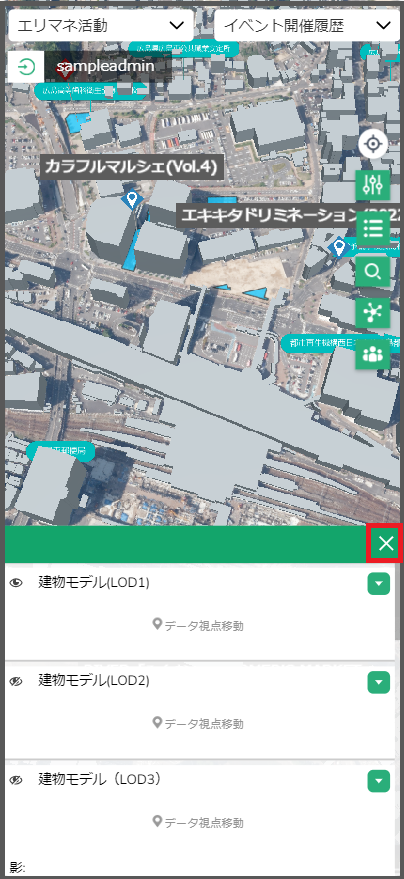
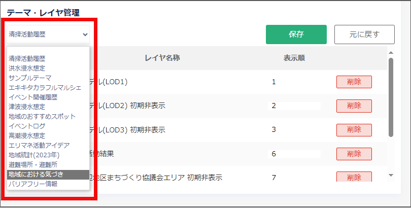

# 操作マニュアル

# 1 利用を開始する

公開画面起動URL：<https://areal-dashboard-hiroshima.com/plateau/>

管理者画面起動URL：<https://areal-dashboard-hiroshima.com/plateau/admin/>

※管理者画面は管理者ユーザのみ利用可能です。

サービスの利用開始時に各種機能の説明が表示される。

右上の「×」ボタンを押下することでナビゲーション画面を閉じる。

*図1-1 ナビゲーション画面の表示*

 

*図1-2 ナビゲーション画面の表示（スマホ画面）*

 
 

# 2 地域情報の登録

エリアマネジメント活動やイベント活動、投稿情報を新しい地点に登録する。

※ログインしたユーザのみ登録が可能

1. ナビボタンにある「地域情報登録」ボタンを押下する。

 　　　　 

*図2-1 地域情報登録ボタンを押下*　　　　　　　　*図2-2 地域情報登録ボタンを押下（スマホ画面）*

 

2. 地域情報登録画面がダッシュボード画面の上に表示されるので、地図画面上の情報を登録したい地点を押下する。

*図2‑3 地域情報登録画面が表示*

 

※スマホ画面では情報を登録したい地点を選択後に地域情報登録画面が表示される。

*図2‑4 ナビゲーションテキストが表示（スマホ画面）*

 

3. 地図画面上のクリックした地点にピンが表示される。

*図2‑5 登録したい地点にピンが表示*

 

*図2‑6 登録したい地点にピンが表示（スマホ画面）*

 

※スマホ画面ではこの時点で地域情報登録画面が表示される。

*図2‑7 地域情報登録画面が表示（スマホ画面）*

 

4. 項目の入力が完了したら「登録」ボタンを押下する。

*図2‑8 地域情報を登録*

 

*図2‑9 地域情報を登録（スマホ画面）*

 

5. 地図画面が更新され、情報を登録した地点にピンが表示される。

*図2‑10 登録された地域情報*

 

*図2-11 登録された地域情報（スマホ画面）*

 
 

## 2-1 《履歴情報を登録する》

エリアマネジメント・イベント活動では既に地域情報を登録した地点に履歴情報を追加することも可能。

1. 地図画面上の編集したい情報が登録されている地点を押下する。

*図2‑12 追加対象の選択*

 

*図2‑13 追加対象の選択（スマホ画面）*

 

2. 属性情報画面が表示される。

*図2‑14 属性情報画面の表示*

 

*図2‑15 属性情報画面の表示（スマホ画面）*

 

3. 属性情報画面の下部に「編集」ボタンが存在しているので押下する。

*図2‑16 編集ボタンの押下*

 

*図2‑17 編集ボタンの押下（スマホ画面）*

 

4. ダッシュボード画面の上に地域情報登録画面が表示される。

*図2‑18 地域情報登録画面（編集）の表示*

 

*図2‑19 地域情報登録画面（編集）の表示（スマホ画面）*

 

5. 地域情報登録画面の右上部分に表示されている「追加」ボタンを押下する。

*図2‑20 履歴情報の追加を押下*

 

*図2‑21 履歴情報の追加を押下（スマホ画面）*

 

6. 項目を編集し、画面下部にある「登録」ボタンを押下する。

*図2‑22 属性情報の登録*

 

*図2‑23 属性情報の登録（スマホ画面）*

 

7. 登録後属性情報画面から開始日時で履歴が選択できるようになっていることを確認する。

*図2‑24 登録情報の確認*

 

*図2‑25 登録情報の確認（スマホ画面）*

 
 

# 3 地域情報の編集

登録済みの地域情報を編集する。

※編集は地域住民ユーザの場合、自身の投稿した情報のみ可能。ただし、履歴の追加は全てのユーザが可能。

1. 地図画面上の編集したい情報が登録されている地点を押下する。

*図3‑1 編集対象の選択*

 

*図3‑2 編集対象の選択（スマホ画面）*

 

2. 属性情報画面が表示される。

*図3‑3 属性情報画面の表示*

 

*図3-4 属性情報画面の表示（スマホ画面）*

 

3. 属性情報画面の下部に「編集」ボタンが存在しているので押下する。

※エリアマネジメント活動・イベント活動の履歴を編集したい場合は画面のレイヤ名の下にあるプルダウンから編集したい履歴を選択して「編集」ボタンを押下する。

 　　　　　　　　　

*図3‑5 編集ボタンの押下*　　　　　　　　　　　　　*図3‑6 編集ボタンの押下（スマホ画面）*

 

4. ダッシュボード画面の上に地域情報登録画面が表示される。

※前の手順で履歴を選択しなかったかつエリアマネジメント活動・イベント活動の履歴を編集したい場合は画面の右上部分にあるプルダウンから編集したい履歴を選択する。

*図3‑7 地域情報登録画面（編集）の表示*

 

*図3‑8 地域情報登録画面（編集）の表示（スマホ画面）*

 

5. 項目を編集し、画面下部にある「更新」ボタンを押下する。

 　　　　　　　

*図3‑9 地域情報の更新*　　　　　　　　　　　　*図3‑10 地域情報の更新（スマホ画面）*

 

6. 属性画面の内容が更新されていることを確認する。

 
 

# 4 地域情報の削除

登録済みの地域情報を削除する。

※削除は地域住民ユーザの場合、公開前の自身の投稿した情報のみ可能。

1. 地図画面上の削除したい情報が登録されている地点を押下する。

*図4‑1 削除対象の選択*

 

*図4‑2 削除対象の選択（スマホ画面）*

 

2. 属性情報画面が表示される。

*図4‑3 属性情報画面の表示*

 

*図4‑4 属性情報画面の表示（スマホ画面）*

 

3. 登録されている情報の下部に「編集」ボタンが存在しているので押下する。

 　　　　　　　

*図4‑5 編集ボタンの押下*　　　　　　　　　　*図4‑6 編集ボタンの押下（スマホ画面）*

 

4. 地域情報登録画面がダッシュボード画面の上に表示される。

*図4‑7 地域情報登録画面（編集）の表示*

 

*図4‑8 地域情報登録画面（編集）の表示（スマホ画面）*

 

5. 画面下部の「削除」ボタンを押下する。

 　　　　　　　

*図4‑9 削除ボタンの押下*　　　　　　　　　　　　　　　*図4‑10　削除ボタンの押下（スマホ画面）*

 

6. 確認ダイアログが表示されるので「OK」を押下する。

*図4‑11 確認ダイアログ*

 

7. 履歴情報がない場合、地域情報登録画面が非表示になり、地図画面からピンが削除されていることを確認する。

 
 

# 5 登録情報の公開承認

ユーザが登録したエリアマネジメント活動、イベント活動、投稿情報の公開を承認する。

1. 管理者メニューから「活動・投稿情報管理」タブを選択する。

*図5‑1 活動・投稿情報管理画面の表示*

 

2. 画面左上部のプルダウンから変更するテーマを選択する。

*図5‑2 公開承認を行うテーマの選択*

 

3. 情報が登録されている地点が表示される。

*図5‑3 テーマに投稿されている情報の表示*

 

4. 各地点のチェックボックスを変更することで、その地点の公開と非公開を変更することが可能。

※履歴情報を含む、エリアマネジメント・イベント活動の場合、次の5で各履歴単位での公開設定が必要になる。

*図5‑4 公開承認状況の更新*

 

5. 地点を押下することでその地点に登録されている履歴情報が表示される。

*図5‑5 地点から履歴情報を表示*

 

6. 各履歴情報のチェックボックスを変更することで、その履歴情報の公開と非公開を変更が可能。

*図5‑6 履歴情報の公開状況更新*

 

7. 画面上部の「保存」ボタンを押下して各公開設定を保存する。

*図5‑7 公開承認状況の保存*

 

8. 確認ダイアログが表示されるので「OK」を選択する。

*図5‑8 確認ダイアログ*

 
 

# 6 データの閲覧

## 6-1《テーマを切り替える》

- 地図画面、グラフ画面及びリスト画面に表示するレイヤのテーマを変更する。

1. 画面左上部にあるプルダウンから表示したいテーマを選択する。

*図6‑1 大項目の選択*

 

*図6‑2 テーマの選択*

 

 　　　　

*図6‑3 大項目の選択（スマホ画面）*　　　　　*図6‑4 テーマの選択（スマホ画面）*

 

2. 地図画面、グラフ画面及びリスト画面の表示が選択したテーマの内容に切り替わる。

*図6‑5 テーマ切替の確認*

 

*図6‑6 テーマ切替の確認（スマホ画面）*

 
 

## 6-2 《背景地図を変更する》

- 地図画面に表示されている背景地図を変更する。

1. ナビボタンの一番上にある「背景地図選択」ボタンを押下する。

 　　　　　　　

*図6‑7 背景地図選択ボタンの押下*　　　　　　　　*図6‑8 背景地図選択ボタンの押下（スマホ画面）*

 

2. 背景地図の選択肢が表示されたポップアップが表示されるので設定したい地図を選択する。

※地図は左から「航空写真」、「全国最新写真」、「地理院地図」、「Dark Master」

　　　　　

*図6‑9 背景地図の選択*　　　　　　　　　　　　　　　　　*図6‑10 背景地図の選択（スマホ画面）*

 

3. 地図画面の背景地図が変更されるので確認する。

*図6‑11 背景地図の変更*

 

*図6‑12 背景地図の変更（スマホ画面）*

 
 

## 6-3 《現在の位置を表示する》

- 地図画面に自分の現在位置を表示する。

1. ナビボタンの上にある「現在位置アイコン」を押下する。

　　　　　

*図6‑13 現在位置アイコンの押下*　　　　　　　*図6‑14 現在位置アイコンの押下（スマホ画面）*

 

2. 地図画面が現在の位置にズームします。

*図6‑15 現在位置の表示*

 

*図6‑16 現在位置の表示（スマホ画面）*

 
 

## 6-4 《凡例を表示する・非表示にする》

- 地図画面に表示されているレイヤの凡例を表示、又は非表示にする。

1. ナビボタンにある「凡例表示」ボタンを押下する。

　　　　

*図6‑17 凡例表示ボタンの押下*　　　　　　　　*図6‑18 凡例表示ボタンの押下（スマホ画面）*

 

2. 地図画面の左側に凡例画面が表示される。

*図6‑19 凡例画面の表示*

 

※スマホ画面の場合は画面下に表示される。

*図6‑20 凡例画面の表示（スマホ画面）*

 

3. 表示されている各凡例名の横にある目のアイコンを押下すると、該当する凡例を地図画面で非表示にすることが可能。もう一度押下すると再度表示される。

*図6‑21 レイヤの表示・非表示の確認*

 

*図6‑22 レイヤの表示・非表示の確認（スマホ画面）*

 

4. 各凡例名の下に表示されている「データ視点移動」を押下するとその凡例にフォーカスすることが可能。

*図6‑23 データ視点移動の押下*

 

*図6‑24 データ視点移動の押下（スマホ画面）*

 

5. 凡例画面の右上に表示される「×」ボタンを押下することで凡例画面が閉じる。

*図6‑25 凡例画面の非表示*

 

*図6‑26 凡例画面の非表示（スマホ画面）*

 
 

## 6-5 《属性情報を表示する》

- 選択した地点の属性情報を表示する。

1. 地図画面上で属性を表示したい地点を押下する。

2. 属性情報画面が表示される。

*図6‑27 属性表示画面の表示*

 

*図6‑28 属性表示画面の表示（スマホ画面）*

 

3. 属性情報の上部にあるレイヤ名を押下するとそのレイヤが閉じ、その地点に登録されている他レイヤの確認が可能。

*図6‑29 同時に選択されている情報の確認*

 

*図6‑30 同時に選択されている情報の確認（スマホ画面）*

 

4. 情報が閉じているレイヤ名を押下するとそのレイヤの属性情報が表示される。

5. エリアマネジメント活動・イベント活動に履歴を登録している場合はレイヤ名の下にあるプルダウンで表示する履歴を変更することが可能。

*図6‑31 履歴情報の閲覧*

 

*図6‑32 履歴情報の閲覧（スマホ画面）*

 

6. 属性情報画面は画面上部をホールドし、ドラッグすることで移動が可能。

*図6‑33 属性表示画面の移動*

 

※スマートフォンでは移動不可能

7. 画面右上部にある「×」ボタンを押下すると画面が閉じる。

 　　　　　　

*図6‑34 属性表示画面の非表示*　　　　　　　　*図6‑35 属性表示画面の非表示（スマホ画面）*

 
 

## 6-6 《経路を検索する》

- 選択された条件に沿った2地点間の最短ルートと距離を検索する。

1. ナビボタンにある「経路検索ボタン」を押下する。

 　　　　

*図6‑36 経路探索ボタンを押下*　　　　　　　　　*図6‑37 経路探索ボタンを押下（スマホ画面）*

 

2. グラフ画面の上に経路検索画面が開く。

*図6‑38 経路検索画面の表示*

 

*図6‑39 経路検索画面の表示（スマホ画面）*

 

3. 地図画面上で開始地点に設定したい場所を押下する。

※経路検索が可能な地点は歩行者空間ネットワークレイヤ上の地点のみ

4. 経路検索画面の上の欄に座標が、地図画面に黄色い点が表示されたことを確認する。

*図6‑40 出発地点の座標入力*

 

*図6‑41 出発地点の座標入力（スマホ画面）*

 

5. 地図画面上で終了地点に設定したい地点を押下する。

※経路検索が可能な地点は歩行者空間ネットワークレイヤ上の地点のみ

6. 経路検索画面の2つ目の欄に座標が、地図画面に赤い点が表示されたことを確認する。

*図6‑42 到着地点の座標入力*

 

*図6‑43 到着地点の座標入力（スマホ画面）*

 

7. 「クリア」ボタンを押下するとそれまでの入力が破棄される。

*図6‑44 出発・到着地点の削除*

 

*図6‑45 出発・到着地点の削除（スマホ画面）*

 

8. プルダウンからルートの条件を選択する。

*図6‑46 ルートの条件を選択*

 

*図6‑47 ルートの条件を選択（スマホ画面）*

 

9. 「検索」ボタンを押下する。

10. 経路検索画面の「検索」ボタンの下に総延長が表示され、地図画面上に最短ルートが表示される。

*図6‑48 経路検索結果の表示*

 

*図6‑49 経路検索結果の表示（スマホ画面）*

 

11. 画面右上部にある「×」ボタンを押下すると画面が閉じ、地図上に表示されていた開始地点、終了地点、検索結果のルートが消える。

*図6‑50 経路検索結果の削除*

 

*図6‑51 経路検索結果の削除（スマホ画面）*

 
 

## 6-7 《町丁目を検索する》

- 町や丁目を名称から検索する。

1. ナビボタンにある「町丁目検索ボタン」を押下する。

*図6‑52 町丁目検索ボタンの押下*

 

*図6‑53 町丁目検索ボタンの押下（スマホ画面）*

 

2. 町丁目検索画面がグラフ画面の上に開く。

*図6‑54 町丁目検索画面の表示*

 

*図6‑55 町丁目検索画面の表示（スマホ画面）*

 

3. 町名のプルダウンから検索したい町名を選択する。

※全検索の場合は「町名」を選択する。

*図6‑56 町名の選択*

 

*図6‑57 町名の選択（スマホ画面）*

 

4. 丁目を検索する場合は町名選択後に丁目名プルダウンから検索したい丁目を選択する。

※丁目が存在しない場合は「丁目名」のみが表示される

※全検索の場合は「丁目名」を選択する

*図6‑58 丁目名の選択*

 

*図6‑59 丁目名の選択（スマホ画面）*

 

5. 「検索」ボタンを押下する。

6. 検索結果の表が「検索」ボタンの下に表示される。

*図6‑60 検索結果の表示*

 

*図6‑61 検索結果の表示（スマホ画面）*

 

7. 検索結果から任意の町丁目を押下すると、地図画面上でその町丁目にズームし、該当する地域がハイライトされる。

*図6‑62 町丁目検索結果の表示*

 

*図6‑63 町丁目検索結果の表示（スマホ画面）*

 

8. 画面右上部にある「×」ボタンを押下すると画面が閉じる。

 
 

# 7 その他の管理者機能

## 7-1 《テーマ・レイヤ公開管理》

- 公開画面で表示するテーマとレイヤの管理・編集を行う。

### 7-1-1 テーマの設定を管理する

- 公開画面で表示するテーマの管理を行う。

1. 管理者メニューから左側の「テーマ・レイヤ公開管理」タブを選択する。

*図7‑1 テーマ・レイヤ公開管理画面の表示*

 

2. テーマ管理の表から公開したいテーマの「公開」列にあるチェックボックスを選択し押下する。

*図7‑2 公開するテーマの選択*

 

3. 投稿可能に設定するテーマの「投稿」列にあるチェックボックスを選択し押下する。

*図7‑3 各レイヤの投稿可否設定*

 

4. テーマ及びテーマグループの名称を変更する場合、変更したいテーマのテキストボックスに入力する。

*図7‑4 テーマ及びテーマグループ名称の変更*

 

5. テーマの表示順を入力する。

*図7‑5 テーマの表示順設定*

 

6. 設定をリセットする場合は「元に戻す」ボタンを押下する。

7. 「保存」ボタンを押下して設定を保存する。

*図7‑6 テーマ設定のリセットと保存*

 
 

### 7-1-2　レイヤを編集する

- 公開画面で表示するレイヤの設定を変更する。

1. 管理者メニューから左側の「テーマ・レイヤ公開管理」タブを選択する。

*図7‑7 テーマ・レイヤ公開管理画面の表示*

 

2. レイヤ管理の表から設定の編集を行いたいレイヤの「編集」ボタンを押下する。

※レイヤの編集は投稿レイヤのみ可能なため、投稿レイヤの行にのみボタンが表示される。

*図7‑8 編集を行うレイヤの選択*

 

3. レイヤ編集画面が開く。

4. 変更したい項目を編集する。

    - レイヤ名：凡例やグラフ、登録画面で表示するレイヤの名称を設定

    - アイコン：地域情報を登録する際に、地図画面上で情報が登録される地点を示すアイコンを設定

    - 属性名：地域情報登録画面・属性表示画面で表示する属性の名称を設定

    - データ型：入力を受け付けるデータの型を設定。テキスト(小)、テキスト(大)、数値、写真、日付から選択が可能
     ※データ型は登録データが一つもない場合にのみ変更可能
    - 表示順：地域情報登録画面及び属性表示画面で属性を表示する順番を設定
     ※数値が小さいほうが先に表示

*図7‑9 レイヤ編集画面の表示*

 

5. 「保存」ボタンを押下して設定を保存する。

6. 「戻る」ボタンでテーマ・レイヤ公開管理画面に戻る。

*図7‑10 レイヤ編集設定の保存*

 
 

### 7-1-3　テーマごとのレイヤを管理する

- 公開画面の各テーマで表示するレイヤを管理する。

1. 管理者メニューから左側の「テーマ・レイヤ公開管理」タブを選択する。

*図7‑11 テーマ・レイヤ公開管理画面の表示*

 

2. テーマ・レイヤ管理表の上にあるプルダウンから管理するテーマを選択する。

*図7‑12 管理するテーマを選択*

 

3. レイヤ管理の表で公開したいレイヤの公開チェックボックスを選択する。

*図7‑13 レイヤの公開管理*

 

4. レイヤ管理の表とテーマ・レイヤ管理の表の間にある「表示追加」ボタンを押下する。

5. テーマ・レイヤ管理の表にレイヤ管理の表でチェックを入れたレイヤが追加されていることを確認する。

*図7‑14 レイヤをテーマへ設定*

 

6. 既に公開しているレイヤを削除する場合は、テーマ・レイヤ管理の表から削除したいレイヤの「削除」ボタンを押下する。

*図7‑15 テーマへ設定されたレイヤの削除*

 

7. 設定をリセットする場合は「元に戻す」ボタンを押下する。

8. 「保存」ボタンを押下して設定を保存する。

*図7-16 テーマ・レイヤ管理のリセットと保存*

 
 

## 7-2 《ダッシュボード管理》

- 公開画面で表示するダッシュボードの追加や削除、表示位置の調整を行う。

### 7-2-1　ダッシュボードの表示を管理する

- 公開画面で表示するダッシュボードのレイアウトを設定する。

1. 管理者メニューから左側の「ダッシュボード管理」タブを選択する。

*図7‑17 ダッシュボード管理画面の表示*

 

2. ダッシュボード管理画面の左上部にあるプルダウンから変更するテーマを選択する。

*図7‑18 テーマの選択*

 

3. 「グラフ・リスト一覧」ボタンを押下する。

*図7‑19 グラフ・リスト一覧の選択*

 

4. 現在登録されているグラフとリストの一覧が表示される。

*図7‑20 グラフ・リスト一覧の表示*

 

5. 一覧から表示したいグラフ・リストの表示列に☑を入れる。

*図7-21 表示したいグラフ・リストを選択*

 

6. 確認ダイアログが表示されるので「OK」を選択する。

*図7‑22 確認ダイアログ*

 

7. ラジオボタンで画面左のダッシュボードと右のダッシュボードのどちらに表示するかを選択する。

*図7‑23 ダッシュボード上での表示位置設定*

 

8. 追加したい全てのグラフ・リストで5～7の作業を行った後、画面上部の「ダッシュボード管理に戻る」ボタンを押下してダッシュボード管理画面へ戻る。

*図7‑24 ダッシュボード表示設定の終了*

 

9. グラフ・リストをドラッグで移動させ、表示を整える。

*図7‑25 グラフ・リストエリアの表示調整1*

 

*図7‑26 グラフ・リストエリアの表示調整2*

 

10. 画面上部の「保存」ボタンを押下してダッシュボードの設定を保存する。

*図7‑27 ダッシュボード設定の保存*

 

11. 確認ダイアログが表示されるので「OK」を押下する。

*図7‑28 確認ダイアログ*

 
 

### 7-2-2　グラフ・リストを追加する

- 公開画面に表示するグラフ・リストを作成する。

1. 管理者メニューから左側の「ダッシュボード管理」タブを選択する。

*図7‑29 ダッシュボード管理画面の表示*

 

2. 画面上部の「グラフ・リスト一覧」ボタンを押下する。

*図7‑30 グラフ・リスト一覧の選択*

 

3. 現在登録されているグラフとリストの一覧が表示される。

*図7‑31 グラフ・リスト一覧の表示*

 

4. 画面上部の「グラフ・リスト追加」ボタンを押下する。

*図7‑32 グラフ・リスト追加の選択*

 

5. グラフ・リスト作成画面に遷移する。

6. 項目の入力と選択を行う。
    - タイトル：作成するグラフ、又はリストの名称を設定
    - タイプ：作成するグラフ、又はリストの種類を選択
    - レイヤ：グラフ、又はリスト作成のために値を取得するレイヤを選択
    - 値属性(数値)：グラフ、又はリスト作成に使用する値の属性を選択
    - ラベル属性：作成するグラフ、又はリストのラベルに使用する属性を設定
      ※「集約関数を設定する」にチェックを入れると値を集計する際の計算方法を（SUM，AVG，MIN，MAX，COUNT）から選択可能
    - ソート属性：どの属性でデータの並び替えを行うか選択
    <br※グラフの場合はラベル属性、又は値属性、リストの場合は表示対象となる属性を指定することが可能
    - ソート方向：ソートを降順に行うか昇順に行うか選択
    - リミット数：取得するデータの件数を設定。1～5000件の間で指定が可能

*図7‑33 グラフ・リスト追加の表示*

 

7. 「サンプル」ボタンを押下すると入力した項目で作成したグラフが表示される。

8. 「戻る」ボタンを押下すると入力が破棄されグラフ・リスト作成画面に戻る。

9. 画面右下の「保存」ボタンを押下して作成したグラフ・リストを保存する。

*図7‑34 グラフ・リストのサンプル*

 

10. 確認ダイアログが表示されるので「OK」を選択する。

*図7‑35 確認ダイアログ*

 

11. グラフ・リスト一覧画面に作成されたグラフ・リストが作成されていることを確認する。

 
 

### 7-2-3　グラフ・リストを編集する

- 公開画面に表示するグラフ・リストを編集する。

1. 管理者メニューから左側の「ダッシュボード管理」タブを選択する。

*図7‑36 ダッシュボード管理画面の表示*

 

2. 画面上部の「グラフ・リスト一覧」ボタンを押下する。

*図7‑37 グラフ・リスト一覧の選択*

 

3. 現在登録されているグラフとリストの一覧が表示される。

*図7‑38 グラフ・リスト一覧の表示*

 

4. 一覧から編集を行うグラフ・リストを選択し、「編集」ボタンを押下する。

*図7‑39 グラフ・リスト編集の選択*

 

5. グラフ・リスト作成画面に遷移する。

*図7‑40 グラフ・リストの編集*

 

6. 項目の入力と選択を行う。

7. 「サンプル」ボタンを押下すると入力した項目で作成したグラフが表示される。

8. 「戻る」ボタンを押下すると入力が破棄され、グラフ・リスト作成画面に戻る。

9. 画面右下の「保存」ボタンを押下して作成したグラフ・リストを保存する。

*図7‑41 グラフ・リスト編集内容の保存*

 

10. 確認ダイアログが表示されるので「OK」を選択する。

*図7‑42 確認ダイアログ*

 
 

### 7-2-4　グラフ・リストを削除する

- 公開画面に表示するグラフ・リストを削除する。
 ※グラフ・リストはユーザが作成したもののみ削除可能。

1. 管理者メニューから左側の「ダッシュボード管理」タブを選択する。

*図7‑43 ダッシュボード管理画面の表示*

 

2. 画面上部の「グラフ・リスト一覧」ボタンを押下する。

*図7‑44 グラフ・リスト一覧の選択*

 

3. 現在登録されているグラフとリストの一覧が表示される。

*図7‑45 グラフ・リスト一覧の表示*

 

4. 一覧から削除を行うグラフ・リストを探し、「削除」ボタンを押下する。

*図7-46 グラフ・リストの削除*

 

5. 確認ダイアログが表示されるので「OK」を選択する。

*図7‑47 確認ダイアログ*

 

6. グラフ・リスト一覧画面に削除したグラフ・リストが存在しないことを確認する。

 
 

## 7-3 《活動・投稿情報管理》

- 登録した活動・投稿情報の公開を承認する。

- 登録した活動・投稿情報の絞り込みとCSVへの出力を行う。

### 7-3-1　登録情報の公開承認

- ユーザが登録したエリアマネジメント活動、イベント活動、投稿情報の公開を承認する。
 
 [５．登録情報の公開承認](#sec5)を参照
 

### 7-3-2　登録情報の絞り込み

- 登録済みの活動・投稿情報を投稿日時で絞り込み、降順又は昇順で表示する。

1. 管理者メニューから左側の「活動・投稿情報管理」タブを選択する。

*図7‑48 活動・投稿情報管理画面の表示*

 

2. 画面左上部分で絞り込みの開始日時と終了日時、並べ方を選択する。

*図7‑49 絞り込み日時の選択1*

 

*図7‑50 絞り込み日時の選択2*

 

*図7‑51 並び替え方法の選択*

 

3. 「絞込み」ボタンを押下して画面に表示する表示投稿情報を絞り込む

*図7‑52 「絞込み」ボタンを押下*

 
 

### 7-3-3　登録情報をCSVデータに出力する

- 画面に表示している活動・投稿情報をCSVファイルに出力する。

1. 管理者メニューから左側の「活動・投稿情報管理」タブを選択する。

*図7‑53 活動・投稿情報管理画面の表示*

 

2. 画面右上にある「CSV出力」ボタンを押下する。

*図7‑54 「CSV出力」ボタンの押下*

 

3. ブラウザからCSVファイルをダウンロードする。

*図7‑55 CSVファイルのダウンロード*

 
 

## 7-4 《地域統計・回遊性情報管理》

- 統計情報、及び回遊性情報の表示とCSVファイルの読み込み、CSVファイルへの出力を行う。

### 7-4-1　統計情報・回遊性情報を確認する

- 登録済みの統計情報及び回遊性情報を確認する。

1. 管理者メニューから左側の「地域統計・回遊性情報管理」タブを選択する。

*図7‑56 地域統計・回遊性情報管理画面の表示*

 

2. 画面上部のプルダウンから確認したい統計項目を選択する。

*図7‑57 統計項目の選択*

 

3. プルダウン横の「テーブル表示」ボタンを押下して各統計情報及び回遊性情報を表示する。

*図7‑58 テーブル表示*

 
 

### 7-4-2　CSVデータに出力する

- 登録済みの統計情報及び回遊性情報をCSV形式で出力する。

1. 管理者メニューから左側の「地域統計・回遊性情報管理」タブを選択する。

*図7‑59 地域統計・回遊性情報管理画面の表示*

 

2. 画面上部のプルダウンから出力したい統計項目を選択する。

*図7‑60 統計項目の選択*

 

3. 画面上部の「CSV出力」ボタンを押下して各統計情報及び回遊性情報を出力する。

*図7‑61 統計項目のCSV出力*

 

4. ブラウザからCSVファイルをダウンロードする。

*図7‑62 CSVファイルのダウンロード*

 
 

### 7-4-3　CSVデータを入力する

- CSVファイルを読み込んで統計情報及び回遊性情報のデータを更新する。
 ※読み込むCSVファイルは [7-4-2. CSVデータに出力する](#sec742)で出力したファイルを編集したものを使用する
 ※既存データの属性値の変更と年度・回数等の追加のみ可能。年度・回数等の削除や、地点等の集計区分の追加は不可

[title742]: #7-4-2-csvデータに出力する

1. 管理者メニューから左側の「地域統計・回遊性情報管理」タブを選択する。

*図7‑63 地域統計・回遊性情報管理画面の表示*

 

2. 画面上部のプルダウンからCSVファイルの入力を行いたい統計項目を選択する。

*図7‑64 統計項目の選択*

 

3. 画面上部の「CSV入力」ボタンを押下してCSVファイルを選択する画面を表示する。

*図7‑65 CSVファイルの入力1*

 

4. 「参照」ボタンを押下してファイルダイアログを開く。

*図7‑66 CSVファイルの入力2*

 

5. 読み込むファイルを選択し、CSVファイルを選択する画面に戻る。

6. 選択したファイル名が表示されていることを確認し、「取込データを表示」ボタンを押下する。

*図7‑67 CSVファイルの入力3*

 

7. 登録内容を確認する画面が表示されるので、選択中の統計項目と表示されている表の内容を確認する。

8. 「CSV選択に戻る」ボタンを押下するとCSVファイルを選択する画面に戻る。

9. 「登録」ボタンを押下して読み込んだCSVファイルのデータを登録する。

*図7‑68 CSVファイルの登録*

 

10. 更新が成功の場合、統計データの更新成功の画面が表示されるので「閉じる」ボタンを押下して画面を閉じる。

*図7‑69 統計データの更新成功*

 
 

## 7-5 《ユーザ管理》

- ユーザ一覧の表示、ユーザの新規作成、編集、削除を行う。

### 7-5-1　ユーザ情報の登録を行う

- 新規ユーザの登録を行う。

1. 管理者メニューから左側の「ユーザ管理」タブを選択する。

*図7‑70 ユーザ管理画面の表示*

 

2. 画面上部にある「新規ユーザ登録」ボタンを押下する。

*図7‑71 新規ユーザ登録の選択*

 

3. ユーザ登録画面が開くので登録するユーザの情報を入力する。
    - ユーザID：ログイン時に使用するユーザのIDを設定
     ※ユーザIDは他のユーザと重複不可
    - ユーザ名：ユーザの名前を設定
    - ユーザグループ：ユーザが所属するグループを選択し権限の種類を設定
    - メールアドレス：メールアドレスを設定
    - パスワード：ログイン時に使用するパスワードを設定
    - パスワード(確認)：ログイン時に使用するパスワードをもう一度入力し確認する

4. 「戻る」ボタンを押下すると入力が破棄されユーザ管理画面に戻る。

5. 画面右下の「保存」ボタンを押下して新規登録するユーザを保存する。

*図7‑72 ユーザ登録の保存*

 

6. ユーザ管理画面に作成したユーザが表示されていることを確認する。

 
 

### 7-5-2　ユーザ情報を編集する

- 登録済みのユーザ情報を編集する。

1. 管理者メニューから左側の「ユーザ管理」タブを選択する。

*図7‑73 ユーザ管理画面の表示*

 

2. 編集するユーザの行の右部にある「編集」ボタンを押下する。

*図7‑74 編集ユーザの選択*

 

3. ユーザ編集画面が開くのでユーザの情報を入力する。
 ※ユーザ編集画面ではユーザIDは変更不可

4. 「戻る」ボタンを押下すると入力が破棄されユーザ管理画面に戻る。

5. 画面右下の「保存」ボタンを押下して編集したユーザの情報を保存する。

*図7‑75 編集内容の保存*

 
 

### 7-5-3　ユーザ情報を削除する

- 登録済みのユーザを削除する。

1. 管理者メニューから左側の「ユーザ管理」タブを選択する。

*図7‑76 ユーザ管理の表示*

 

2. 削除するユーザの行の右側にある「削除」ボタンを押下する。

*図7‑77 削除ユーザの選択*

 

3. 確認ダイアログが表示されるので「OK」を選択する。

*図7‑78 確認ダイアログ*

 

4. ユーザ管理画面に削除したユーザが存在しないことを確認する。
